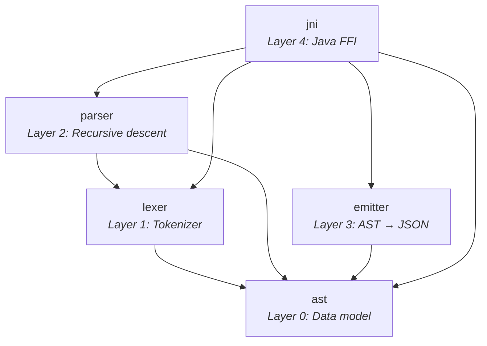

# Architecture

## Crate Dependency Graph



## Key Traits

| Trait | Crate | Purpose | When to Implement |
|-------|-------|---------|-------------------|
| `Spanned` | ast | Source location access | Every AST node with a `source_info` field |
| `Packageable` | ast | Package-qualified elements | `ClassDef`, `EnumDef`, `FunctionDef`, etc. |
| `Annotated` | ast | Stereotypes & tagged values | Elements that carry `<<stereo>>` `{tag = 'val'}` |
| `ElementVisitor` | ast | Walk top-level elements | Emitter, compiler passes, linters |
| `ExpressionVisitor` | ast | Walk expression trees | Emitter, type checker, optimizer |
| `IslandPlugin` | parser | Parse `#>{}#`, `#s{}#` syntax | Each island grammar type |
| `SectionPlugin` | parser | Parse `###Section` grammars | Each section grammar type |

## AST Design Principles

1. **AST ≠ Protocol JSON** — The AST uses `Arithmetic { op, left, right }` while JSON normalizes to `{"_type": "func", "function": "plus", "parameters": [...]}`. The emitter handles translation.
2. **No serde in AST** — Keeps the AST lean for direct compiler consumption.
3. **Type parameters supported** — Unlike the Java parser which rejects `Class X<T>{}`, we parse and preserve type parameters for future compiler use.

## Token → AST → JSON Flow

```
Source:    "Class model::Person { name: String[1]; }"

  ↓ Lexer

Tokens:    [Class, Ident("model"), PathSep, Ident("Person"),
            LBrace, Ident("name"), Colon, Ident("String"),
            LBracket, Integer(1), RBracket, Semi, RBrace]

  ↓ Parser

AST:       Element::Class(ClassDef {
             package: ["model"],
             name: "Person",
             properties: [Property { name: "name", type: String, mult: [1] }],
           })

  ↓ Emitter

JSON:      { "_type": "class", "package": "model", "name": "Person",
             "properties": [{ "name": "name", "type": "String",
             "multiplicity": { "lowerBound": 1, "upperBound": 1 } }] }
```

## Decision Log

| Decision | Rationale |
|----------|-----------|
| `SmolStr` not `String` for identifiers | 24-byte inline; O(1) clone; most identifiers < 24 chars |
| `tracing` not `log` | Structured spans map to grammar rules; async-aware |
| No `serde` in AST crate | Keeps AST independent of serialization format |
| Type parameters supported | Forward-compatible with future generic type support |
| `thiserror` for errors | Zero-cost derive; standard practice |
| `insta` for snapshots | `--review` workflow; JSON golden file comparison |
| `cargo-llvm-cov` for coverage | LLVM source-based; accurate; CI gate support |
