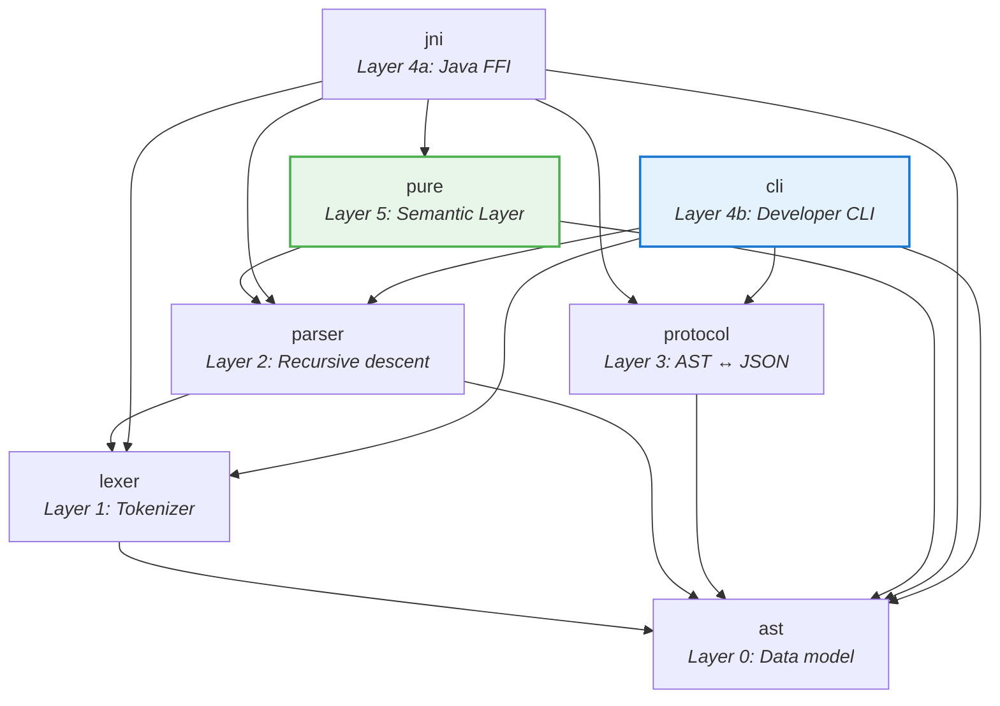

# Architecture

## Crate Dependency Graph



## Key Traits

| Trait | Crate | Purpose | When to Implement |
|-------|-------|---------|-------------------|
| `Spanned` | ast | Source location access | Every AST node with a `source_info` field |
| `Annotated` | ast | Stereotypes & tagged values | Elements that carry `<<stereo>>` `{tag = 'val'}` |
| `PackageableElement` | ast | Package-qualified elements (`Spanned + Annotated`) | `ClassDef`, `EnumDef`, `FunctionDef`, etc. |
| `ElementVisitor` | ast | Walk top-level elements | Protocol, compiler passes, linters |
| `ExpressionVisitor` | ast | Walk expression trees | Protocol, type checker, optimizer |
| `IslandPlugin` | parser | Parse `#>{}#`, `#s{}#` syntax | Each island grammar type |
| `SectionPlugin` | parser | Parse `###Section` grammars | Each section grammar type |
| `CompilerExtension` | pure | Plugin hook: `declare()`, `define()`, `validate()` | Each element kind (core & plugins) |

## Derive Macros (`ast-derive`)

| Derive | Generates | Required Fields |
|--------|-----------|----------------|
| `#[derive(Spanned)]` | `Spanned` | `source_info` |
| `#[derive(Annotated)]` | `Spanned` + `Annotated` | `stereotypes`, `tagged_values`, `source_info` |
| `#[derive(PackageableElement)]` | `Spanned` + `Annotated` + `PackageableElement` | `package`, `name`, `source_info` |

The hierarchy mirrors trait supertraits: `PackageableElement: Spanned + Annotated`. Each higher-level derive automatically generates lower-level impls — **use only one derive per struct**.

## AST Design Principles

1. **AST ≠ Protocol JSON** — The AST uses `Arithmetic { op, left, right }` while JSON normalizes to `{"_type": "func", "function": "plus", "parameters": [...]}`. The protocol crate handles translation.
2. **No serde in AST** — Keeps the AST lean for direct compiler consumption.
3. **Type parameters supported** — Unlike the Java parser which rejects `Class X<T>{}`, we parse and preserve type parameters for future compiler use.

## Token → AST → JSON Flow

```
Source:    "Class model::Person { name: String[1]; }"

  ↓ Lexer

Tokens:    [Class, Ident("model"), PathSep, Ident("Person"),
            LBrace, Ident("name"), Colon, Ident("String"),
            LBracket, Integer(1), RBracket, Semi, RBrace]

  ↓ Parser

AST:       Element::Class(ClassDef {
             package: ["model"],
             name: "Person",
             properties: [Property { name: "name", type: String, mult: [1] }],
           })

  ↓ Protocol

JSON:      { "_type": "class", "package": "model", "name": "Person",
             "properties": [{ "name": "name", "type": "String",
             "multiplicity": { "lowerBound": 1, "upperBound": 1 } }] }
```

## Decision Log

| Decision | Rationale |
|----------|-----------|
| `SmolStr` not `String` for identifiers | 24-byte inline; O(1) clone; most identifiers < 24 chars |
| `tracing` not `log` | Structured spans map to grammar rules; async-aware |
| No `serde` in AST crate | Keeps AST independent of serialization format |
| Type parameters supported | Forward-compatible with future generic type support |
| `thiserror` for errors | Zero-cost derive; standard practice |
| `insta` for snapshots | `--review` workflow; JSON golden file comparison |
| `cargo-llvm-cov` for coverage | LLVM source-based; accurate; CI gate support |
| Arena/Index not `Rc<RefCell<>>` in Pure | Zero borrow-checker friction; O(1) lookup; trivially serializable |
| Segmented `ElementId(chunk_id, local_idx)` | Zero-rewrite model merging — push chunk, link packages, done |
| Unidirectional nodes + derived indexes | Eliminates 5 Java bidirectional mutation patterns; safe for parallel reads |
| `SourceInfo` on all Pure nodes | Required for compilation diagnostics and runtime execution error reporting |
| No `Generalization` node in Pure | Direct `Vec<ElementId>` for supertypes; inverted index for specializations |
| Expression not desugared | Keeps `Expression` isomorphic to AST form; enables future Pure→AST emission |
| Hard/Soft dependency classification | Supports cyclic data models (Person↔Company) while enforcing acyclic inheritance |
| `bincode` for PureModel serialization | Near-instant startup from cached model; `serde` derives only on Pure nodes |
| Global packages + chunked elements | Packages span chunks (unified namespace); elements stay local (O(1) merge) |
