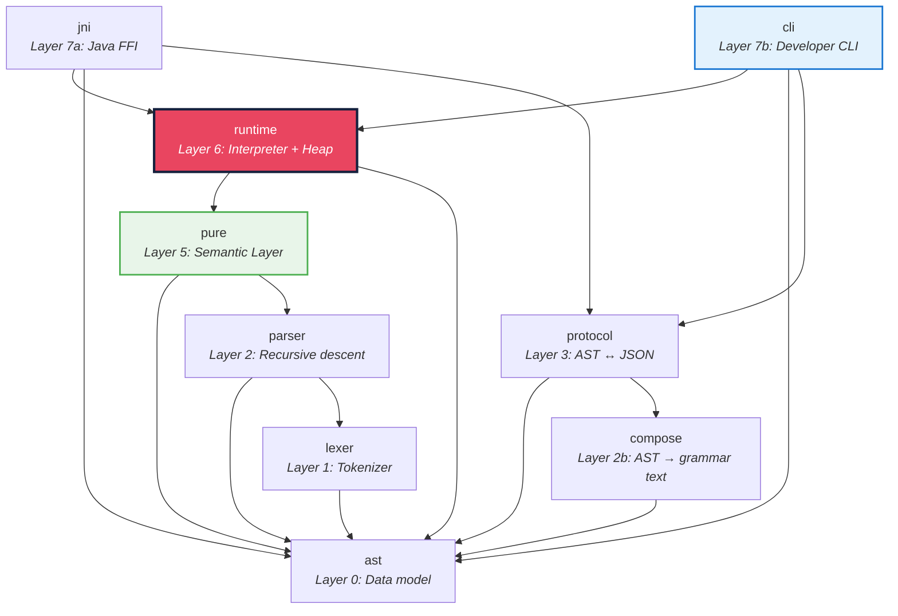

# Runtime Architecture

## Overview

The `runtime` crate implements the Pure interpreter execution engine. It evaluates
compiled Pure expressions against a `PureModel` (from the `pure` crate), producing
runtime `Value`s.

## Position in the Crate Graph



## Four-Layer Storage Model

```
┌─────────────────────────────────────────────────────────┐
│ Layer 1: Model Arena (Arc<PureModel>)                   │
│ ─────────────────────────────────────                   │
│ Immutable compiled model. Class definitions, function   │
│ definitions, type hierarchy. Shared across threads.     │
│ Lives in the `pure` crate.                              │
├─────────────────────────────────────────────────────────┤
│ Layer 2: Runtime Heap (RuntimeHeap)                     │
│ ──────────────────────────────────                      │
│ Mutable object storage. SlotMap<ObjectId, HeapEntry>.   │
│ Each entry is Dynamic (HashMap) or Typed (struct).      │
│ Per-executor, not shared across threads.                │
├─────────────────────────────────────────────────────────┤
│ Layer 3: Value Stack (VariableContext)                   │
│ ─────────────────────────────────────                   │
│ Scoped variable bindings. Push/pop for let-bindings,    │
│ function parameters, $this references.                  │
├─────────────────────────────────────────────────────────┤
│ Layer 4: Extension Points                               │
│ ────────────────────────                                │
│ CompiledFunction trait — AOT-compiled Pure functions.   │
│ TypedObject trait — generated struct access.             │
│ RuntimeEnv trait — polyglot dispatch (Java/Python/WASM). │
└─────────────────────────────────────────────────────────┘
```

## Core Types

### Value (`value.rs`)

```rust
pub enum Value {
    Boolean(bool),        // inline, no heap allocation
    Integer(i64),         // inline
    Float(f64),           // inline
    Decimal(SmolStr),     // string representation (for now)
    String(SmolStr),      // inline ≤24 bytes, shared heap for longer
    Date(SmolStr),        // string representation (for now)
    Object(ObjectId),     // handle into RuntimeHeap
    Collection(PVector<Value>),       // RRB-tree persistent vector
    Map(PMap<ValueKey, Value>),       // HAMT persistent hash map
    Unit,                 // empty/void
}
```

**Design decisions:**
- Primitives are **unboxed** — no heap allocation for `Integer`, `Float`, `Boolean`
- Collections use `im_rc` persistent structures — O(log N) structural sharing
- Objects are **handles** (`ObjectId`) — not ownership, just identity reference

### RuntimeHeap (`heap.rs`)

```rust
pub struct RuntimeHeap {
    objects: SlotMap<ObjectId, HeapEntry>,
}

pub enum HeapEntry {
    Dynamic(RuntimeObject),          // HashMap<SmolStr, PVector<Value>>
    Typed(Box<dyn TypedObject>),     // Generated struct (hybrid compilation)
}
```

**Dual representation:**
- `Dynamic`: Interpreter-created objects with property-name-based access (~13ns lookup)
- `Typed`: Compiled-code objects with direct field access (~1ns)
- Both produce `Value::Object(ObjectId)` — callers don't know which is active

### VariableContext (`context.rs`)

Push/pop scope chain for lexical scoping. Variables resolve innermost-first.

## Execution Model (Future)

```
evaluate_function(function_id, args)
    │
    ├── Priority 1: Native (built-in Rust)     → map, filter, +, -
    ├── Priority 2: Compiled (generated crate)  → hot user Pure functions
    ├── Priority 3: Memoized (cache hit)        → pure function cache
    └── Priority 4: Interpreted (expression tree walk)
```

## Thread Safety

- `PureModel` (compiled model) → `Arc`-shared, immutable, `Send + Sync`
- `Executor` (heap + context) → thread-local, NOT `Send` (`im_rc` uses `Rc`)
- Pattern: shared-immutable model, per-thread-mutable executor

## Benchmark Baselines

First measured numbers (criterion.rs, release mode):

| Operation | Time |
|---|---|
| Integer create + match | 1.2 ns |
| Float create + match | 1.8 ns |
| SmolStr clone (short) | 4.0 ns |
| PVector clone (1000 elems) | 6.1 ns — O(1) structural sharing! |
| Property access (dynamic) | 13.5 ns |
| Object allocation | 13.5 ns |
| mutateAdd | 29.4 ns |
| HAMT put (10K items) | 1.05 ms |
| std HashMap clone-per-put (1K) | 2.67 ms — 25x slower than HAMT |

## Dependencies

| Crate | Purpose |
|---|---|
| `im-rc` | Persistent collections (HAMT HashMap, RRB Vector) |
| `slotmap` | Generational arena for RuntimeHeap (ObjectId) |
| `smol_str` | Inline strings (≤24 bytes, no allocation) |
| `thiserror` | Error derive macros |

## Design Documents

Detailed architecture decisions are documented in:

- [Architecture Deep Questions](docs/runtime/architecture_deep_questions.md) — Bootstrap, threading, polyglot dispatch, grammar, Java interop
- [Hybrid Compilation](docs/runtime/hybrid_compilation.md) — Compiled functions, struct-based classes, codegen pipeline
- [Performance Comparison](docs/runtime/performance_comparison.md) — Java interpreted vs compiled vs Rust interpreted
- [Benchmarking Strategy](docs/runtime/benchmarking_strategy.md) — Three-tier benchmark framework
- [Persistent Data Structures](docs/runtime/persistent_data_structures.md) — HAMT/RRB for collections, columnar for Relation
- [Memoization](docs/runtime/memoization.md) — Purity analysis, cache strategies
- [Metaprogramming](docs/runtime/metaprogramming.md) — MetaAccessor, deactivate/reactivate
- [MutateAdd Mechanics](docs/runtime/mutateadd_mechanics.md) — Heap mutation strategy
