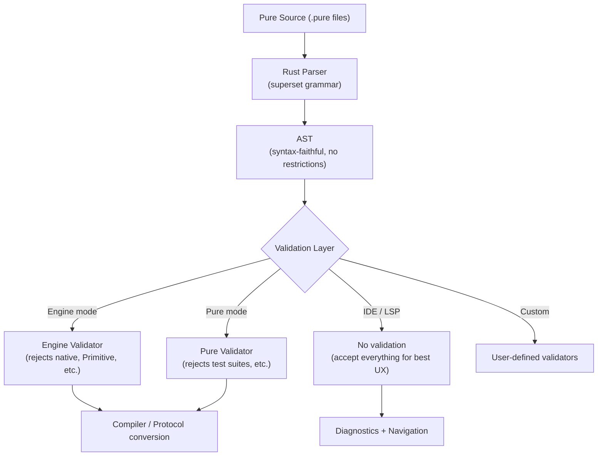

# Grammar Convergence Strategy — Superset + Validators

## Core Principle

> **Parse the superset. Validate per-context.**

The Rust parser accepts the **union** of all Pure and Engine grammar features. Restrictions
for specific use cases (Engine-only, IDE, etc.) are enforced by pluggable validators that
run *after* parsing, not by limiting the grammar itself.

## Architecture



## Decision Log — Per Divergence

Based on user decisions from artifact review:

| # | Divergence | Decision | Grammar Owns | Validator Restricts |
|---|-----------|----------|-------------|-------------------|
| 1 | `native function` | **Converge to Pure** | ✅ Parse + produce AST | Engine validator can block |
| 2 | `Primitive` definitions | **Converge to Pure** | ✅ Parse + produce AST | Engine validator can block |
| 3 | Top-level `instance` | **SKIP** — Only used in `m3.pure` bootstrap (145 instances). Rust bootstraps from code, not `.pure` files. | ❌ Not needed | — |
| 4 | Inline `mapping` in M3 | **NOT A DIVERGENCE** — Shared sub-grammar used by `###Mapping` section parser, same in both systems | N/A | N/A |
| 5 | `aggregateSpecification` | **Likely Pure-only** | ✅ Parse if present | Engine validator can block |
| 6 | `typeVariableParameters` | **Converge to Pure** | ✅ Parse + produce AST | Engine validator can block |
| 7 | Function constraints | **Converge to Pure** | ✅ Parse + produce AST | Engine validator can block |
| 8 | Function test suites | **Converge to Engine** | ✅ Parse + produce AST | Backward compat (additive) |
| 9 | Slice expressions `[s:e:step]` | **Converge to Pure** | ✅ Parse + produce AST | — |
| 10 | Type operations `T+U`, `T-U`, `T⊆U` | **Converge to Pure** | ✅ Parse + produce AST | Engine validator can block |
| 11 | Navigation paths `#/Type/prop#` | **Converge to Engine** | ✅ Parse via island system | — |
| 12 | Island grammar dispatch | **Find compromise** | Trait-based plugin (current Rust approach) | — |
| 13 | Wildcard columns `?` | **Converge to Pure** | ✅ Parse + produce AST | — |

## Validator Design

### Interface

```rust
/// A grammar validation profile that controls which constructs are allowed.
pub trait GrammarValidator {
    /// Human-readable name for diagnostics (e.g., "Legend Engine 4.x")
    fn name(&self) -> &str;

    /// Check a top-level element. Return diagnostics for disallowed constructs.
    fn validate_element(&self, element: &Element) -> Vec<Diagnostic>;

    /// Check an expression. Return diagnostics for disallowed constructs.
    fn validate_expression(&self, expr: &Expression) -> Vec<Diagnostic>;

    /// Check a type reference. Return diagnostics for disallowed constructs.
    fn validate_type(&self, type_ref: &TypeReference) -> Vec<Diagnostic>;
}
```

### Engine Validator (example)

```rust
pub struct EngineValidator;

impl GrammarValidator for EngineValidator {
    fn name(&self) -> &str { "Legend Engine" }

    fn validate_element(&self, element: &Element) -> Vec<Diagnostic> {
        let mut diags = vec![];
        match element {
            // Engine rejects native functions
            Element::Function(f) if f.is_native => {
                diags.push(Diagnostic::error(
                    f.source_info.clone(),
                    "Native functions are not supported in Legend Engine",
                ));
            }
            // Engine rejects Primitive definitions
            Element::Primitive(_) => {
                diags.push(Diagnostic::error(
                    element.source_info().clone(),
                    "Primitive type definitions are not supported in Legend Engine",
                ));
            }
            // Engine rejects type parameters on Classes
            Element::Class(c) if !c.type_parameters.is_empty() => {
                diags.push(Diagnostic::error(
                    c.source_info.clone(),
                    "Type parameters are not authorized in Legend Engine",
                ));
            }
            _ => {}
        }
        diags
    }

    // ... similar for expressions and types
}
```

### Usage in CLI

```rust
// Parse (superset — accepts everything)
let ast = parser::parse(source)?;

// Validate (context-specific)
let validator = EngineValidator;
let diagnostics = ast.all_elements()
    .flat_map(|e| validator.validate_element(e))
    .collect::<Vec<_>>();

// Report but don't block parsing
for diag in &diagnostics {
    eprintln!("{}", diag);
}
```

## What This Unlocks

1. **Single parser binary** — No more maintaining two Java parsers with divergent ANTLR grammars
2. **IDE parity** — LSP can show all features, with validator warnings for context-inappropriate ones
3. **Gradual migration** — Engine users see warnings when using Pure-only features, not parse errors
4. **Testing** — One test suite validates the superset grammar; validators have separate tests
5. **Future-proof** — New features are added to the grammar once, validators updated independently

## Open Design Questions

> [!IMPORTANT]
> **Island grammar compromise**: The current Rust parser uses a trait-based `IslandParser`
> plugin system. Pure uses `#...#` (single token, runtime dispatch). Engine uses ANTLR lexer
> modes for structured content. The trait approach already supports both models — the question
> is whether the lexer should recognize `#Tag{...}#` at the token level or if the parser should
> handle the dispatch. Current Rust approach (parser-level dispatch) seems right.

> [!IMPORTANT]
> **Inline mapping**: Should the unified grammar include Pure's inline mapping syntax
> (`~src`, `~filter`, `mappingLine`), or should mappings remain section-only (Engine style)?
> Engine's approach is cleaner for separation of concerns, but Pure's approach is needed for
> bootstrapping. **Recommendation**: Support both — inline mapping parses into the AST,
> Engine validator blocks it if unwanted.

> [!IMPORTANT]
> **Milestoning syntax**: The Rust parser currently treats `.all()` and `.all(%latest)` as
> ordinary function calls. The Engine grammar has special rules for these. Since the current
> Rust approach is simpler and still parseable, we should keep it — the compiler/protocol
> layer can handle the special semantics. No grammar change needed.
