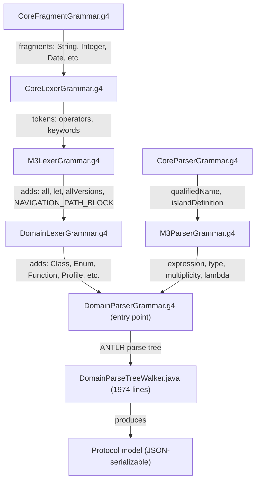

# Legend Engine Grammar vs Rust Parser — Gap Analysis

> **Goal**: Identify what the Rust parser (`legend-pure-parser`) is missing relative to the Java
> Legend Engine grammar, so we can converge into a **single parser**.

## Architecture Overview

The Java grammar is layered as:



The Rust parser **handrolls** all of these layers into unified crates:

```
crates/lexer   → CoreFragment + CoreLexer + M3Lexer + DomainLexer
crates/parser  → M3Parser + DomainParser (recursive descent)
crates/ast     → AST model (replaces ANTLR parse tree)
crates/compose → Roundtrip composer
```

---

## Overlapping Areas — Feature Matrix

### 1. Top-Level Elements

| Element | Engine Grammar | Rust Parser | Gap |
|---------|---------------|-------------|-----|
| `Class` | ✅ | ✅ | None |
| `Enum` | ✅ | ✅ | None |
| `Function` | ✅ | ✅ | None |
| `Profile` | ✅ | ✅ | None |
| `Association` | ✅ | ✅ | None |
| `Measure` | ✅ | ✅ | None |
| `native Function` | ✅ grammar rule, **error at walker** | ✅ lexer token exists | See §3 |
| `instance` (top-level) | ✅ as `elementDefinition` | ❌ **Not supported** | **GAP #1** |

> [!WARNING]
> **GAP #1 — Top-level `instance` syntax**. The Engine grammar has `instance` as a valid
> `elementDefinition` (line 43 of DomainParserGrammar.g4): `^ClassName(prop='val')` at the
> top level. The Rust parser only handles `^` as an expression, not as a top-level element.
> The tree walker does process this via `visitElement → instance`. This is rarely used in
> practice but exists in the grammar.

---

### 2. Class Definition Features

| Feature | Engine | Rust | Gap |
|---------|--------|------|-----|
| Stereotypes `<<profile.stereo>>` | ✅ | ✅ | None |
| Tagged values `{tag.name='val'}` | ✅ | ✅ | None |
| `extends` (single/multiple) | ✅ | ✅ | None |
| Type parameters `<T, U>` | ✅ grammar, **error at walker** | ✅ parsed, stored in AST | See note |
| Multiplicity parameters `<T|m>` | ✅ grammar, **error at walker** | ❌ **Not in AST** | **GAP #2** |
| Contravariance `-T` | ✅ grammar rule | ❌ | **GAP #3** |
| Properties | ✅ | ✅ | None |
| Qualified (derived) properties | ✅ | ✅ | None |
| Aggregation kinds `(composite)` | ✅ | ✅ | None |
| Default values | ✅ | ✅ | None |
| Constraints | ✅ | ✅ | None |
| Projection (`projects`) | ✅ | ❌ **Not supported** | **GAP #4** |

> [!NOTE]
> Type parameters: The Engine grammar accepts them but the walker throws
> `"Type and/or multiplicity parameters are not authorized in Legend Engine"`.
> The Rust parser stores `type_parameters: Vec<Identifier>` but does NOT parse or store
> multiplicity parameters. If we want grammar parity, we **should** parse them (even if
> the compiler rejects them later).

> [!IMPORTANT]
> **GAP #4 — Class Projection (`projects`)**. The Engine grammar supports
> `Class Foo projects #{ ... }#` syntax (line 52-53 of DomainParserGrammar.g4) as an
> alternative to a class body. This uses either a DSL island or a `treePath`. The Rust parser
> has no notion of this.

---

### 3. Function Definition Features

| Feature | Engine | Rust | Gap |
|---------|--------|------|-----|
| Stereotypes & tagged values | ✅ | ✅ | None |
| Parameters with types | ✅ | ✅ | None |
| Return type & multiplicity | ✅ | ✅ | None |
| Type/multiplicity parameters `<T|m>` | ✅ grammar, **error at walker** | ❌ | Same as **GAP #2** |
| Constraints on functions | ✅ | ❌ **Not parsed** | **GAP #5** |
| Function test suites | ✅ | ✅ | None |
| `native function` | ✅ grammar rule exists | ❌ **Not parsed** | **GAP #6** |

> [!WARNING]
> **GAP #5 — Function constraints**. The Engine grammar has `constraints?` between
> the function signature and the body (line 156 of DomainParserGrammar.g4). The Rust parser
> goes straight from signature to `{body}`.

> [!WARNING]
> **GAP #6 — `native function`**. The Engine grammar has a distinct
> `nativeFunction: NATIVE FUNCTION qualifiedName typeAndMultiplicityParameters? functionTypeSignature SEMI_COLON`
> rule (no body). The Rust lexer recognizes `native` as a keyword but the parser doesn't
> handle the `native function` element definition.

---

### 4. Constraint Features

| Feature | Engine | Rust | Gap |
|---------|--------|------|-----|
| Simple constraints (unnamed) | ✅ | ✅ | None |
| Named constraints | ✅ | ✅ | None |
| Complex constraints (full form) | ✅ | ✅ | None |
| `~owner` | ✅ | ❌ **Not in AST** | **GAP #7** |
| `~externalId` | ✅ | ✅ (`external_id`) | None |
| `~function` | ✅ | ✅ (`function_definition`) | None |
| `~enforcementLevel` | ✅ | ✅ (`enforcement_level`) | None |
| `~message` | ✅ | ✅ (`message`) | None |

> [!IMPORTANT]
> **GAP #7 — Constraint `~owner`**. The Java grammar and walker support a `~owner: identifier`
> field in complex constraints (`constraint.owner`). The Rust `Constraint` struct has no
> `owner` field.

---

### 5. Expression Grammar

| Construct | Engine | Rust | Gap |
|-----------|--------|------|-----|
| Literals: Integer, Float, Decimal, String, Boolean | ✅ | ✅ | None |
| Date literals (`%2024-01-15`) | ✅ | ✅ | None |
| DateTime literals | ✅ | ✅ | None |
| StrictTime literals | ✅ | ✅ | None |
| `%latest` (CLatestDate) | ✅ | ✅ (via StrictDate hack) | Representation differs |
| Variables `$x` | ✅ | ✅ | None |
| Arithmetic `+`, `-`, `*`, `/` | ✅ | ✅ | None |
| Comparison `==`, `!=`, `<`, `<=`, `>`, `>=` | ✅ | ✅ | None |
| Boolean `&&`, `\|\|` | ✅ | ✅ | None |
| Not `!expr` | ✅ | ✅ | None |
| Signed expression `+expr`, `-expr` | ✅ | ✅ | None |
| Arrow function `->` | ✅ | ✅ | None |
| Property access `.name` | ✅ | ✅ | None |
| Qualified property `.name(args)` | ✅ | ✅ | None |
| Function application `func(args)` | ✅ | ✅ | None |
| Lambda `{x \| body}`, `x \| body`, `\| body` | ✅ | ✅ | None |
| Let expression | ✅ | ✅ | None |
| Collection `[1, 2, 3]` | ✅ | ✅ | None |
| New instance `^Type(...)` | ✅ | ✅ | None |
| Type reference `@Type` | ✅ | ✅ | None |
| Column specs `~col`, `~col: ...`, `~[col:Type]` | ✅ | ✅ | None |
| **Bitwise operators** `&&&`, `\|\|\|`, `^^^`, `<<<`, `>>>` | ❌ | ✅ | Rust ahead |
| **Bitwise complement** `~~~` | ❌ | ✅ | Rust ahead |
| Navigation path `#/path/prop#` | ✅ | ❌ **Not supported** | **GAP #8** |
| `toBytes('...')` literal | ✅ | ❌ **Not supported** | **GAP #9** |
| Unit instance `5 kg~Kilogram` | ✅ grammar, **throws at walker** | ❌ | **GAP #10** |
| Property bracket `expr['key']`, `expr[0]` | ✅ (deprecated) | ❌ | **GAP #11** |
| `all()`, `.all()` | ✅ specialised rules | ❌ Not as dedicated construct | **GAP #12** |
| `allVersions()` | ✅ | ❌ | **GAP #12** |
| `allVersionsInRange(from, to)` | ✅ grammar, **error at walker** | ❌ | **GAP #12** |
| `.all(%latest)` milestoning | ✅ | ❌ | **GAP #12** |
| `.prop(%latest)` milestoning | ✅ | ❌ | **GAP #12** |

> [!WARNING]
> **GAP #8 — Navigation paths** (`#/Type/prop1/prop2#`).  The Engine has a dedicated
> `NAVIGATION_PATH_BLOCK` lexer rule (`#/...#`) and a full `NavigationParserGrammar.g4` that
> produces `ClassInstance("path", ...)`. The Rust parser has no support for this.

> [!IMPORTANT]
> **GAP #9 — `toBytes()` literal**. The Engine grammar has `toBytes('data')` as a primitive
> value that produces `CByteArray`. No equivalent exists in Rust.

> [!WARNING]
> **GAP #12 — Milestoning-specific syntax**. The Engine grammar has dedicated rules for
> milestoning: `.all(%latest)`, `.all(date1, date2)`, `.allVersions()`,
> `.allVersionsInRange(from, to)`, and `.prop(%latest)`. These are all special-cased in
> the walker (lines 1681–1730). The Rust parser treats `.all()` as an ordinary function call,
> which is actually simpler, but diverges from the Engine's explicit grammar rules.
> This may or may not matter depending on whether the Rust parser's approach is sufficient.

---

### 6. Type System

| Feature | Engine | Rust | Gap |
|---------|--------|------|-----|
| Qualified type `pkg::Type` | ✅ | ✅ | None |
| Type arguments `Type<A, B>` | ✅ | ✅ | None |
| Multiplicity arguments `Type<A\|m>` | ✅ | ❌ **Not in AST** | **GAP #13** |
| Type variable values `Type(200)` | ✅ | ✅ | None |
| Function type `{A[1]->B[*]}` | ✅ | ✅ (via compiler crate) | ⚠️ Check |
| Relation type `(a:Type, b:Type)` | ✅ | ❌ **Not in AST** | **GAP #14** |
| Unit type `Measure~Unit` | ✅ | ✅ (`UnitReference`) | None |

> [!WARNING]
> **GAP #13 — Multiplicity arguments**. The Engine grammar's `type` rule allows
> `Type<TypeArgs | MultArgs>` (pipe-separated). The Rust AST has `type_arguments: Vec<TypeReference>`
> but no field for multiplicity arguments. This is used for generic types like `Function<...|m>`.

> [!WARNING]
> **GAP #14 — Relation type in AST**. The Engine grammar has `relationType: PAREN_OPEN columnInfo
> (COMMA columnInfo)* PAREN_CLOSE` as a first-class `type` alternative. The Rust `type_ref.rs`
> has no `RelationType` variant. The compiler crate (`pure/src/types.rs`) does appear to model
> this, but it's not in the parser AST.

---

### 7. Island Grammars

| Grammar | Engine | Rust | Gap |
|---------|--------|------|-----|
| Graph fetch tree `#{Type{props}}#` | ✅ | ✅ | None |
| Navigation path `#/Type/prop#` | ✅ | ❌ | **GAP #8** |
| Tagged islands `#tag{content}#` | ✅ (extensible) | ✅ (trait-based plugin) | None |

---

### 8. Association Features

| Feature | Engine | Rust | Gap |
|---------|--------|------|-----|
| Properties & qualified properties | ✅ | ✅ | None |
| Stereotypes & tagged values | ✅ | ✅ | None |
| Association projection | ✅ grammar rule | ❌ | **GAP #15** |

> [!NOTE]
> **GAP #15 — Association projection**. The Engine grammar has `associationProjection:
> PROJECTS qualifiedName LESS_THAN qualifiedName COMMA qualifiedName GREATER_THAN`.
> The Rust parser doesn't support this.

---

### 9. Section/File Structure

| Feature | Engine | Rust | Gap |
|---------|--------|------|-----|
| `###Pure` section headers | ✅ | ✅ | None |
| Multiple sections per file | ✅ | ✅ | None |
| `import pkg::path::*;` | ✅ | ✅ | None |

---

## Priority-Ranked Gap Summary

| Priority | Gap # | Feature | Risk Level | Notes |
|----------|-------|---------|------------|-------|
| 🔴 P0 | #8 | Navigation paths `#/Type/prop#` | Used in production models | Separate embedded parser in Engine |
| 🔴 P0 | #12 | Milestoning syntax `.all(%latest)`, `.prop(%latest)` | Core temporal modeling feature | Critical for bi-temporal support |
| 🔴 P0 | #14 | Relation type in parser AST `(col:Type, ...)` | Used by TDS/relation features | Already in compiler, needs AST |
| 🟡 P1 | #13 | Multiplicity arguments on types `<T\|m>` | Generic function types | Engine rejects but grammar allows |
| 🟡 P1 | #6 | `native function` declarations | Used in platform code | No body, just signature + `;` |
| 🟡 P1 | #9 | `toBytes('...')` literal | Used for binary data | Simple addition |
| 🟡 P1 | #7 | Constraint `~owner` field | Used in some models | Missing field in AST |
| 🟡 P1 | #5 | Function constraints | Parsed but rare | Grammar supports it |
| 🟢 P2 | #1 | Top-level `instance` | Extremely rare | May not need |
| 🟢 P2 | #2, #3 | Multiplicity params, contravariance `<-T>` | Engine rejects them | Parse-only, no semantic use |
| 🟢 P2 | #4, #15 | Class/Association projection (`projects`) | Legacy feature | Rarely used |
| 🟢 P2 | #10 | Unit instance literals `5 kg~Unit` | Engine throws at walker | Parse-only |
| 🟢 P2 | #11 | Property bracket `expr['key']` | Deprecated in Engine | Slated for removal |

---

## Where Rust is Ahead

The Rust parser already supports constructs the Engine grammar does NOT:

| Feature | Rust | Engine |
|---------|------|--------|
| Bitwise operators (`&&&`, `\|\|\|`, `^^^`, `<<<`, `>>>`) | ✅ | ❌ |
| Bitwise complement (`~~~`) | ✅ | ❌ |
| Explicit `Group(parenthesized)` AST node | ✅ | ❌ (implicit in ANTLR) |
| Trait-based island plugin system | ✅ | ❌ (hardcoded dispatch) |
| Type parameters stored in ClassDef | ✅ | ❌ (rejected at walker) |

---

## Semantic Divergences (Same Syntax, Different Processing)

Even where both parsers handle the same syntax, there are semantic differences in how they
produce output:

| Area | Engine Behavior | Rust Behavior |
|------|----------------|---------------|
| **Operators as functions** | `1 + 2` → `AppliedFunction("plus", [Collection([1, 2])])` | `1 + 2` → `ArithmeticExpr { left: 1, op: Plus, right: 2 }` |
| **`let` expressions** | `let x = 1` → `AppliedFunction("letFunction", [CString("x"), 1])` | `let x = 1` → `LetExpr { name: "x", value: 1 }` |
| **`not` expressions** | `!x` → `AppliedFunction("not", [x])` | `!x` → `NotExpr { operand: x }` |
| **`-expr` sign** | `-x` → `AppliedFunction("minus", [x])` | `-x` → `UnaryMinusExpr { operand: x }` |
| **`==` / `!=`** | `a == b` → `AppliedFunction("equal", ...)` | `a == b` → `ComparisonExpr { op: Equal, ... }` |
| **`new` instance** | `^T(...)` → `AppliedFunction("new", [GenericType, "", Collection])` | `^T(...)` → `NewInstanceExpr { class, assignments }` |
| **Pair/TdsOlapRank desugaring** | Walker desugars `^Pair(first=a, second=b)` → `pair(a, b)` | No desugaring — stores as `NewInstanceExpr` |
| **`.all()` function** | `Type.all()` → `AppliedFunction("getAll", [PackageableElementPtr])` | `Type.all()` → arrow/member access chain |

> [!IMPORTANT]
> These are **not bugs**. The Rust parser produces a **syntax-faithful AST** while the Engine
> walker produces a **desugared protocol model**. The Rust compiler crate (`pure`) or protocol
> crate is responsible for the lowering/desugaring step. This is the correct architecture for a
> parser that also needs to serve IDE features (hover, go-to-definition, roundtripping).

---

## Recommended Actions

1. **P0: Add relation type to parser AST** — Already modeled in the compiler crate; need to bubble up to `TypeReference`/`TypeSpec` so the parser can produce it directly.

2. **P0: Add navigation path support** — Add a new island grammar plugin or a dedicated lexer/parser mode for `#/Type/prop1/prop2#`.

3. **P0: Decide on milestoning syntax** — Either:
   - (a) Keep treating `.all(%latest)` as ordinary member access / function calls (simpler, currently works), or
   - (b) Add dedicated milestoning-aware rules to match the Engine grammar exactly.

4. **P1: Add `native function` parsing** — Simple: detect `native function`, parse the signature, no body, produce a `FunctionDef` with `is_native: true`.

5. **P1: Add `toBytes()` literal** — New literal type `ByteArray` in the AST.

6. **P1: Add constraint `~owner`** — Add `owner: Option<Identifier>` to `Constraint` struct.

7. **P1: Add function constraints** — Parse `constraints?` between function signature and body.

8. **P1: Add multiplicity arguments to types** — Add `multiplicity_arguments: Vec<Multiplicity>` to `TypeReference`.

9. **P2: Consider projection, association projection, top-level instance** — These are rarely used; can be deferred.
