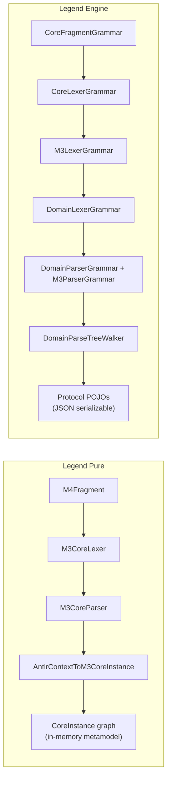

# Legend Pure vs Legend Engine — Grammar Divergence Analysis

> **Goal**: Compare the two Java parsers to identify what each supports and where they
> diverge, in order to build a single unified Rust parser that covers both.

## Source Files Compared

| Component | Legend Pure (M3) | Legend Engine |
|-----------|-----------------|---------------|
| **Top-level grammar** | [M3CoreParser.g4](file:///Users/cocobey73/Projects/legend-pure/legend-pure-core/legend-pure-m3-core/src/main/antlr4/org/finos/legend/pure/m3/serialization/grammar/m3parser/antlr/core/M3CoreParser.g4) | [DomainParserGrammar.g4](file:///Users/cocobey73/Projects/legend-engine/legend-engine-core/legend-engine-core-base/legend-engine-core-language-pure/legend-engine-language-pure-grammar/src/main/antlr4/org/finos/legend/engine/language/pure/grammar/from/antlr4/domain/DomainParserGrammar.g4) + [M3ParserGrammar.g4](file:///Users/cocobey73/Projects/legend-engine/legend-engine-core/legend-engine-core-base/legend-engine-core-language-pure/legend-engine-language-pure-grammar/src/main/antlr4/org/finos/legend/engine/language/pure/grammar/from/antlr4/core/M3ParserGrammar.g4) |
| **Lexer** | [M3CoreLexer.g4](file:///Users/cocobey73/Projects/legend-pure/legend-pure-core/legend-pure-m3-core/src/main/antlr4/org/finos/legend/pure/m3/serialization/grammar/m3parser/antlr/core/M3CoreLexer.g4) (imports M4Fragment) | [CoreLexerGrammar.g4](file:///Users/cocobey73/Projects/legend-engine/legend-engine-core/legend-engine-core-base/legend-engine-core-language-pure/legend-engine-language-pure-grammar/src/main/antlr4/org/finos/legend/engine/language/pure/grammar/from/antlr4/core/CoreLexerGrammar.g4) (imports CoreFragmentGrammar) |
| **Tree walker** | [AntlrContextToM3CoreInstance.java](file:///Users/cocobey73/Projects/legend-pure/legend-pure-core/legend-pure-m3-core/src/main/java/org/finos/legend/pure/m3/serialization/grammar/m3parser/antlr/AntlrContextToM3CoreInstance.java) (4,075 lines) | [DomainParseTreeWalker.java](file:///Users/cocobey73/Projects/legend-engine/legend-engine-core/legend-engine-core-base/legend-engine-core-language-pure/legend-engine-language-pure-grammar/src/main/java/org/finos/legend/engine/language/pure/grammar/from/domain/DomainParseTreeWalker.java) (1,974 lines) |
| **Section system** | [TopAntlrParser.g4](file:///Users/cocobey73/Projects/legend-pure/legend-pure-core/legend-pure-m3-core/src/main/antlr4/org/finos/legend/pure/m3/serialization/grammar/top/antlr/TopAntlrParser.g4) (`\n###SectionName`) | [CodeParserGrammar.g4](file:///Users/cocobey73/Projects/legend-engine/legend-engine-core/legend-engine-core-base/legend-engine-core-language-pure/legend-engine-language-pure-grammar/src/main/antlr4/org/finos/legend/engine/language/pure/grammar/from/antlr4/CodeParserGrammar.g4) (`SECTION_START`) |
| **Output model** | `CoreInstance` graph (mutable M3 metamodel) | Protocol POJOs (JSON-serializable) |

---

## Architecture Difference



> [!IMPORTANT]
> The fundamental architectural difference: **Legend Pure** builds a mutable `CoreInstance` graph
> (the M3 metamodel in-memory), while **Legend Engine** builds lightweight protocol POJOs for
> JSON serialization. The Rust parser builds an immutable AST (closer to Engine's approach)
> then converts to protocol via the `protocol` crate.

---

## 1. Top-Level Elements

| Element | Pure | Engine | Divergence |
|---------|------|--------|------------|
| `Class` | ✅ | ✅ | ✅ Same structure |
| `Enum` | ✅ | ✅ | ✅ Same structure |
| `Function` | ✅ | ✅ | ⚠️ See §3 for constraint/test differences |
| `Profile` | ✅ | ✅ | ✅ Same structure |
| `Association` | ✅ | ✅ | ✅ Same structure |
| `Measure` | ✅ | ✅ | ⚠️ Slightly different unit syntax |
| `native function` | ✅ **Fully supported** | ✅ Grammar only, **error at walker** | 🔴 **DIVERGENCE #1** |
| `Primitive` definition | ✅ **Fully supported** | ❌ **Not in grammar** | 🔴 **DIVERGENCE #2** |
| Top-level `instance` | ✅ **Fully supported** | ❌ **Not in grammar** | ~~DIVERGENCE #3~~ **NOT NEEDED** |
| `mapping` (inline) | ✅ **In M3 grammar** | ❌ Only via `###Mapping` section | ~~DIVERGENCE #4~~ **NOT A DIVERGENCE** |
| Top-level `aggregateSpecification` | ✅ **In M3 grammar** | ❌ **Not in grammar** | 🔴 **DIVERGENCE #5** |

> [!WARNING]
> **DIVERGENCE #1 — `native function`**: Legend Pure parses AND processes native functions
> as first-class `NativeFunctionInstance`. Legend Engine's grammar has the rule BUT the
> walker throws: `"Type and/or multiplicity parameters are not authorized in Legend Engine"`.
> The Engine never produces a native function object.

> [!WARNING]
> **DIVERGENCE #2 — `Primitive` definitions**: Legend Pure supports user-defined primitive
> types (`Primitive MyType extends String`). The Engine grammar has **no** `primitiveDefinition`
> rule at all. This is a Pure metamodel concept with no Engine equivalent.

> [!NOTE]
> **~~DIVERGENCE #3~~ — Top-level `instance` — NOT NEEDED**: Only used in `m3.pure` (145
> instances) to bootstrap the Pure metamodel graph (`^Package Root`, `^Package meta`, etc.).
> Since the Rust parser bootstraps from Rust code (not `.pure` files), **this is not needed**.
> Can be added behind a feature flag if ever required.
>
> Previously described as: Legend Pure supports `^ClassName<TypeArgs>
> instanceName(?[file:1,2,3,4,5,6]?) @classifier (prop=value, ...)` as a top-level
> definition. Engine's grammar only has `expressionInstance` (inside expressions), not as
> a standalone top-level element. The Pure instance syntax also supports:
> - A `FILE_NAME` source-info annotation: `?[file:1,2,3,4,5,6]?`
> - An `@classifier` annotation: `@qualifiedName`
> - `instanceBlock`: `[instance1, instance2]` vector syntax
> - Nested instances in property assignments

> [!NOTE]
> **~~DIVERGENCE #4~~ — Inline `mapping` — NOT A DIVERGENCE**: The `mapping`, `mappingLine`,
> `~src`, `~filter` rules in `M3CoreParser.g4` are NOT a top-level definition. They are a
> **shared sub-grammar** that the `###Mapping` section parser (`MappingParser.g4`) delegates
> to via `M3AntlrParser.parseMapping()` for parsing individual class mapping bodies.
> Both Pure and Engine handle mappings through the `###Mapping` section — the difference
> is just ANTLR structural layering, not a feature divergence.

---

## 2. Class Definition Features

| Feature | Pure | Engine | Divergence |
|---------|------|--------|------------|
| Stereotypes & tagged values | ✅ | ✅ | ✅ Same |
| `extends` (multiple) | ✅ | ✅ | ✅ Same |
| Type parameters `<T, U>` | ✅ Full support | ✅ Grammar + **error at walker** | 🟡 Engine blocks it |
| Multiplicity parameters `<T|m>` | ✅ Full support | ✅ Grammar + **error at walker** | 🟡 Engine blocks it |
| Contravariance `-T` | ✅ Full support | ✅ Grammar + **error at walker** | 🟡 Engine blocks it |
| `typeVariableParameters` `(x:Type[1])` | ✅ | ❌ **Not in Engine** | 🔴 **DIVERGENCE #6** |
| Properties | ✅ | ✅ | ✅ Same |
| Qualified properties | ✅ | ✅ | ✅ Same |
| Aggregation kinds | ✅ | ✅ | ✅ Same |
| Default values | ✅ | ✅ | ✅ Same |
| Constraints | ✅ | ✅ | ⚠️ See §4 |
| Projection (`projects`) | ✅ | ✅ | ✅ Same structure |

> [!NOTE]
> **DIVERGENCE #6 — `typeVariableParameters`**: Pure supports `Class Foo(x: String[1])` — 
> parenthesized variable parameters after the class name, before type parameters. Engine
> has no equivalent. This is a Pure metamodel feature for parameterized types with runtime values.

---

## 3. Function Definition Features

| Feature | Pure | Engine | Divergence |
|---------|------|--------|------------|
| Stereotypes & tagged values | ✅ | ✅ | ✅ Same |
| Parameters | ✅ | ✅ | ✅ Same |
| Return type + multiplicity | ✅ | ✅ | ✅ Same |
| Type/multiplicity parameters | ✅ Full support | ✅ Grammar, **error at walker** | 🟡 Engine blocks it |
| Constraints on functions | ✅ `constraints?` | ❌ **Not in Engine grammar** | 🔴 **DIVERGENCE #7** |
| Function test suites | ❌ **Not in Pure** | ✅ Full inline testing | 🔴 **DIVERGENCE #8** |
| `functionDescriptor` rule | ✅ `qualified(Type[1]):Type[1]` | ❌ **Not in Engine** | 🟡 Pure-only |

> [!IMPORTANT]
> **DIVERGENCE #7 — Function constraints**: Pure grammar supports `constraints?` after the
> function signature but before the body. Engine omits this entirely.
>
> **DIVERGENCE #8 — Function test suites**: Engine has a rich inline testing grammar
> (`functionTestSuiteDef`, `simpleFunctionTest`, `simpleFunctionSuite`, `functionData`,
> `externalFormatValue`, `embeddedData`). Pure has **none** of this — all testing is done
> external to the grammar.

---

## 4. Constraint Features

| Feature | Pure | Engine | Divergence |
|---------|------|--------|------------|
| Simple (unnamed) constraints | ✅ | ✅ | ✅ Same |
| Named constraints | ✅ | ✅ | ✅ Same |
| Complex constraints | ✅ | ✅ | ✅ Same structure |
| `~owner` | ✅ | ✅ | ✅ Both support it |
| `~externalId` | ✅ | ✅ | ✅ Same |
| `~function` | ✅ | ✅ | ✅ Same |
| `~enforcementLevel` | ✅ | ✅ | ✅ Same |
| `~message` | ✅ | ✅ | ✅ Same |

✅ Constraints are **identical** between the two parsers.

---

## 5. Expression Grammar — The Core Differences

### 5a. Shared expression features (identical syntax)

Both grammars share these expression constructs with identical syntax:
- Literals: Integer, Float, Decimal, String, Boolean, Date, StrictTime, `%latest`
- Variables `$x`, Lambda `{x | body}`, Let `let x = ...`
- Arithmetic `+`, `-`, `*`, `/`
- Comparison `==`, `!=`, `<`, `<=`, `>`, `>=`
- Boolean `&&`, `||`, Not `!`
- Signed expressions `+expr`, `-expr`
- Arrow function `->`
- Property access `.name`, `.name(args)`
- Function application `func(args)`
- Collection `[1, 2, 3]`
- New instance expression `^Type(prop=val)`
- Column specs `~col`, `~[col1, col2]`
- `%latest` date literal

### 5b. Features in Legend Pure but NOT in Legend Engine

| Feature | Pure Rule | Notes |
|---------|-----------|-------|
| **Slice expression** `[:end]`, `[start:end]`, `[start:end:step]` | `sliceExpression` | 🔴 **DIVERGENCE #9** — Full Python-style slicing. Engine has nothing equivalent. |
| **`expressionOrExpressionGroup`** as distinct rule | Rules distinguish grouped vs ungrouped | ✅ Same semantic, different rule structure |
| **Top-level instance in expressions** | `instance` in `atomicExpression` | Pure can reference `^Type @classifier` with file info annotations |
| **`instanceBlock`** `[inst1, inst2]` | `instanceBlock` rule | Vector of instances — not in Engine |
| **`stereotypeReference`** in expressions | `qualifiedName AT identifier` | 🟡 Allows referencing stereotypes as values |
| **`tagReference`** in expressions | `qualifiedName PERCENT identifier` | 🟡 Allows referencing tags as values |
| **Instance `@classifier`** | `(AT qualifiedName)?` | Extra classifier annotation on instances |
| **Instance `FILE_NAME`** | `?[file:1,2,3,4,5,6]?` | Inline source-info annotation |
| **Type operations in type arguments** | `typeWithOperation`, `addType`, `subType`, `subsetType`, `equalType` | 🔴 **DIVERGENCE #10** — Pure supports type arithmetic: `T + U`, `T - U`, `T ⊆ U`, `T = U` in type argument positions |
| **`unitInstance` literal** | `5 kg~Kilogram` | ✅ Grammar rule in both, but Engine throws at walker |
| **DSL island** via `#...#` hash-delimited | `DSL_TEXT` token | Simple: everything between `#` and `#` is one token |

> [!WARNING]
> **DIVERGENCE #9 — Slice expressions**: Pure has `[start:end:step]` Python-style slicing as
> a first-class `nonArrowOrEqualExpression`. Engine has **no** slice expression syntax at all.
> The walker builds `SimpleFunctionExpression` for `slice` with up to 3 args (start, end, step).

> [!WARNING]
> **DIVERGENCE #10 — Type operations**: Pure's `typeArguments` rule uses `typeWithOperation`
> which allows `T + U`, `T - U`, `T ⊆ U`, `T = U` as type-level computations. These are
> used for type algebra in the generics system. Engine's type arguments are just a comma-
> separated list of plain types — no type operations.

### 5c. Features in Legend Engine but NOT in Legend Pure

| Feature | Engine Rule | Notes |
|---------|-------------|-------|
| **Navigation path** `#/Type/prop1/prop2#` | `dslNavigationPath`, `NAVIGATION_PATH_BLOCK` | 🔴 **DIVERGENCE #11** — Separate lexer mode + `NavigationParserGrammar.g4`. Pure has no equivalent inline syntax. |
| **Island grammar** with tagged dispatch `#Tag{...}#` | `dslExtension`, `ISLAND_OPEN/CLOSE` | 🔴 **DIVERGENCE #12** — Engine has an extensible island system (`ISLAND_OPEN`, `dslExtensionContent`, `ISLAND_END`). Pure uses the simpler `DSL_TEXT` (everything between `#...#`). |
| **`toBytes('...')`** literal | `toBytesLiteral: TO_BYTES_FUNCTION PAREN_OPEN STRING PAREN_CLOSE` | 🟡 No Pure equivalent. |
| **Property bracket expression** `expr['key']` / `expr[0]` | `propertyBracketExpression` (deprecated) | 🟡 Deprecated in Engine, doesn't exist in Pure. |
| **Function test suites** (inline) | `functionTestSuiteDef`, `simpleFunctionTest`, etc. | See DIVERGENCE #8 above |
| **`embeddedData`** | `embeddedData: identifier ISLAND_OPEN ...` | Test data definition inside functions |
| **`externalFormatValue`** | `(contentType) STRING` | For test assertions |
| **`primitiveValue`** as distinct concept | `primitiveValueAtomic`, `primitiveValueVector` | Engine separates primitive values for test params |

> [!IMPORTANT]
> **DIVERGENCE #12 — Island grammar system**: This is a **fundamental structural divergence**.
> - **Pure**: `DSL_TEXT: '#' .*? '#'` — A single catch-all token. The hash-delimited content
>   is passed to an `InlineDSLLibrary` for dispatch *after* lexing.
> - **Engine**: Uses ANTLR lexer modes (`ISLAND_OPEN`, `ISLAND_CONTENT`, `ISLAND_END`) to
>   create structured tokens. Supports tagged dispatch (`#Tag{content}#`) and separate parser
>   grammars (`GraphFetchTreeParserGrammar`, `NavigationParserGrammar`).
>
> The Rust parser uses a `trait IslandParser` system that dispatches based on the tag, which
> is closest to the Engine model but more extensible.

---

## 6. Type System

| Feature | Pure | Engine | Divergence |
|---------|------|--------|------------|
| Qualified types `pkg::Type` | ✅ | ✅ | ✅ Same |
| Type arguments `<A, B>` | ✅ | ✅ | ✅ Same |
| Multiplicity arguments `<T\|m>` | ✅ | ✅ | ✅ Same syntax |
| Function type `{A[1]->B[*]}` | ✅ `functionTypePureType` | ✅ `functionTypePureType` | ✅ Same |
| Relation type `(col:Type, ...)` | ✅ `columnType` | ✅ `columnInfo` | ⚠️ Different rule names, same semantics |
| Unit type `Measure~Unit` | ✅ `unitName` | ✅ `unitName` | ✅ Same |
| Type variable values `Type(200)` | ✅ `typeVariableValues` | ✅ `typeVariableValues` | ✅ Same |
| **Type operations** `T + U`, `T - U` | ✅ | ❌ | 🔴 See DIVERGENCE #10 |
| **`?` wildcard in relation columns** | ✅ `mayColumnName`, `mayColumnType` | ❌ | 🔴 **DIVERGENCE #13** |
| **SUBSET `⊆`** operator | ✅ as token | ❌ | Part of DIVERGENCE #10 |

> [!NOTE]
> **DIVERGENCE #13 — Wildcard columns**: Pure's relation type allows `?` as both column name
> and column type (`mayColumnName: QUESTION | columnName`, `mayColumnType: QUESTION | type`).
> Engine's `columnInfo` requires a concrete `columnName` and `type`.

---

## 7. Instance Syntax — Deep Comparison

This is one of the biggest divergence areas. Both parsers have `^Type(props)` syntax but with different capabilities:

### Pure instance (top-level + expression)
```antlr
// Top-level (a definition, like Class or Enum)
instance: NEW_SYMBOL qualifiedName
          (LESSTHAN typeArguments? (PIPE multiplicityArguments)? GREATERTHAN)?
          identifier?                                    // optional instance name
          (FILE_NAME ... FILE_NAME_END)?                 // source info annotation
          (AT qualifiedName)?                            // classifier annotation
          GROUP_OPEN
              (instancePropertyAssignment (COMMA instancePropertyAssignment)*)?
          GROUP_CLOSE
;

// Property assignment (simple = syntax)
instancePropertyAssignment: propertyName EQUAL instanceRightSide
;
// Right side can be: literal | %latest | nested instance | qualifiedName | enum | stereotype | tag
instanceAtomicRightSide: instanceLiteral | LATEST_DATE | instance | qualifiedName
                       | enumReference | stereotypeReference | tagReference | identifier
;

// Expression-level (inside lambdas, function bodies)
expressionInstance: NEW_SYMBOL (variable | qualifiedName) ...  // same basic shape
;
```

### Engine instance (expression only)
```antlr
// Expression-level only — no top-level instances
expressionInstance: NEW_SYMBOL (variable | qualifiedName)
                   (LESS_THAN typeArguments? (PIPE multiplicityArguments)? GREATER_THAN)?
                   (identifier)?
                   (typeVariableValues)?
                   PAREN_OPEN
                       expressionInstanceParserPropertyAssignment?
                       (COMMA expressionInstanceParserPropertyAssignment)*
                   PAREN_CLOSE
;

// Property assignment with dotted path + PLUS? syntax
expressionInstanceParserPropertyAssignment:
    propertyName (DOT propertyName)* PLUS? EQUAL expressionInstanceRightSide
;
// Right side is full combinedExpression
expressionInstanceAtomicRightSide: combinedExpression | expressionInstance | qualifiedName
;
```

Key differences:

| Aspect | Pure | Engine |
|--------|------|--------|
| Top-level definition? | ✅ Yes | ❌ No |
| Instance name | Optional identifier | Optional identifier |
| `@classifier` annotation | ✅ `(AT qualifiedName)?` | ❌ |
| `?[file:...]?` source annotation | ✅ | ❌ |
| `instanceBlock` `[i1, i2]` | ✅ | ❌ |
| Property dotted path `a.b.c = val` | ❌ Simple `propertyName = val` | ✅ `propertyName (DOT propertyName)* PLUS? EQUAL` |
| `PLUS?` on assignment | ❌ | ✅ `prop += val` |
| RHS can be full expression | ❌ Limited to atomics | ✅ `combinedExpression` |
| RHS can reference stereotypes/tags | ✅ `stereotypeReference` / `tagReference` | ❌ |
| `variable` as target | Only in `expressionInstance` | ✅ `(variable | qualifiedName)` |

---

## 8. Measure/Unit Syntax

| Feature | Pure | Engine |
|---------|------|--------|
| Canonical unit `* unitExpr` | ✅ `canonicalUnitExpr: STAR unitExpr` | ✅ `canonicalExpr` |
| Non-convertible units | ✅ `nonConvertibleUnitExpr: identifier SEMI_COLON` | ✅ `nonConvertibleMeasureExpr: qualifiedName SEMI_COLON` |
| Unit conversion | ✅ `unitConversionExpr: identifier ARROW codeBlock` | ✅ `unitExpr: qualifiedName COLON identifier ARROW codeBlock` |
| Unit naming | ✅ Plain `identifier` (relative to measure) | ✅ `qualifiedName` (can be fully-qualified) |

Mostly the same. Engine uses `qualifiedName` for unit names while Pure uses simple `identifier`.

---

## 9. DSL / Island Grammar Dispatch

| Aspect | Pure | Engine |
|--------|------|--------|
| Lexer approach | `DSL_TEXT: '#' .*? '#'` (one token, all content) | Lexer modes: `ISLAND_OPEN`, `dslExtensionContent*`, `ISLAND_END` |
| Tagged dispatch | `InlineDSLLibrary` (runtime dispatch) | `EmbeddedPureParser` (extension registry) |
| Graph fetch tree | Via `InlineDSLLibrary` dispatch | Via `GraphFetchTreeParserGrammar.g4` (separate ANTLR grammar) |
| Navigation path | ❌ **Not supported** | Via `NavigationParserGrammar.g4` (`NAVIGATION_PATH_BLOCK`) |
| Extension mechanism | `InlineDSL` interface + library | `PureGrammarParserExtension` SPI |

> [!NOTE]
> Legend Pure has a separate `NavigationParser.g4` in `legend-pure-dsl-path`, which handles
> path DSLs (`/Type/prop1/prop2`). But it's integrated via the `InlineDSLLibrary` dispatch
> rather than having a dedicated lexer token like Engine's `NAVIGATION_PATH_BLOCK`.

---

## 10. Section/File System

| Aspect | Pure | Engine |
|--------|------|--------|
| Section separator | `\n###SectionName` (requires leading newline) | `###SectionName` (SECTION_START token) |
| Section content | Opaque text until next separator | Opaque text until next separator |
| Import handling | `import pkg::path::*;` | `import pkg::path::*;` |

Functionally identical.

---

## Summary Matrix — What Each Has

````carousel
### Legend Pure — Unique Features

| # | Feature | Grammar Rule | Impact |
|---|---------|-------------|--------|
| 1 | `native function` (fully processed) | `nativeFunction` | 🔴 Must support |
| 2 | `Primitive` type definitions | `primitiveDefinition` | 🟡 Platform only |
| 3 | Top-level `instance` definitions | `instance` in `definition` | 🟡 Platform/bootstrap |
| 4 | Inline `mapping` in M3 grammar | `mapping`, `mappingLine` | 🟡 Pure compiler only |
| 5 | `aggregateSpecification` | `aggregateSpecification` | 🟡 Pure compiler only |
| 6 | `typeVariableParameters` on classes | `typeVariableParameters` | 🟡 Pure metamodel only |
| 7 | Function constraints | `constraints?` after signature | 🟡 Platform code |
| 8 | Slice expressions `[start:end:step]` | `sliceExpression` | 🔴 Used in Pure runtime |
| 9 | Type operations `T+U`, `T-U`, `T⊆U` | `typeWithOperation` | 🔴 Used in generics |
| 10 | Wildcard columns `?` in relations | `mayColumnName`, `mayColumnType` | 🟡 Relation algebra |
| 11 | Instance `@classifier` annotation | `(AT qualifiedName)?` | 🟡 Bootstrap |
| 12 | Instance `?[file:...]?` source info | `FILE_NAME ... FILE_NAME_END` | 🟡 Internal |
| 13 | `instanceBlock` `[inst1, inst2]` | `instanceBlock` | 🟡 Graph serialization |
| 14 | Stereotype/tag references in exprs | `stereotypeReference`, `tagReference` | 🟡 Annotations as values |
| 15 | `functionDescriptor` rule | `functionDescriptor` | 🟡 Metadata |

<!-- slide -->

### Legend Engine — Unique Features

| # | Feature | Grammar Rule | Impact |
|---|---------|-------------|--------|
| 1 | Navigation paths `#/Type/prop#` | `dslNavigationPath`, `NAVIGATION_PATH_BLOCK` | 🔴 Used in production |
| 2 | Structured island grammars `#Tag{...}#` | `dslExtension`, `ISLAND_OPEN` modes | 🔴 Extension system |
| 3 | `toBytes('...')` literal | `toBytesLiteral` | 🟡 Binary data |
| 4 | Property bracket `expr['key']` | `propertyBracketExpression` (deprecated) | 🟢 Can skip |
| 5 | Function test suites (inline) | `functionTestSuiteDef`, `simpleFunctionTest` | 🔴 Core testing |
| 6 | `embeddedData` definitions | `embeddedData` | 🟡 Test infrastructure |
| 7 | `externalFormatValue` | `(contentType) STRING` | 🟡 Test assertions |
| 8 | `primitiveValue` / `primitiveValueAtomic` | Separate rules for test params | 🟡 Test infrastructure |
| 9 | Property dotted-path assignment `a.b = val` | `expressionInstanceParserPropertyAssignment` | 🟡 Nested property set |
| 10 | `PLUS?` in instance assignment `prop += val` | `PLUS? EQUAL` | 🟡 Additive set |
| 11 | `Pair`/`TdsOlapRank`/`BasicColumnSpecification` desugaring | Walker-level (`newFunction`) | 🟡 Compatibility |
````

---

## Priority Guide for Rust Parser Convergence

### 🔴 P0 — Must Support (both parsers use these actively)

| # | Feature | Source | Rust Status |
|---|---------|--------|-------------|
| 1 | `native function` | Pure | ❌ Not parsed |
| 2 | Slice expressions `[start:end:step]` | Pure | ❌ Not parsed |
| 3 | Type operations `T+U`, `T-U`, `T⊆U` | Pure | ❌ Not in AST |
| 4 | Navigation paths `#/Type/prop#` | Engine | ❌ Not parsed |
| 5 | Structured island grammars `#Tag{...}#` | Engine | ✅ Trait-based system |
| 6 | Function test suites | Engine | ✅ Partially supported |

### 🟡 P1 — Important for full parity

| # | Feature | Source | Rust Status |
|---|---------|--------|-------------|
| 7 | `Primitive` definitions | Pure | ❌ |
| 8 | Top-level `instance` | Pure | ❌ |
| 9 | Function constraints | Pure | ❌ |
| 10 | Wildcard columns `?` in relation types | Pure | ❌ |
| 11 | `typeVariableParameters` on classes | Pure | ❌ |
| 12 | `toBytes('...')` literal | Engine | ❌ |
| 13 | Stereotype/tag references as expr values | Pure | ❌ |

### 🟢 P2 — Lower priority / can defer

| # | Feature | Source | Notes |
|---|---------|--------|-------|
| 14 | Inline `mapping` in M3 grammar | Pure | Pure compiler only |
| 15 | `aggregateSpecification` | Pure | Pure compiler only |
| 16 | Instance `@classifier` / `?[file:]?` | Pure | Internal/bootstrap |
| 17 | `instanceBlock` `[inst1, inst2]` | Pure | Graph serialization |
| 18 | Property bracket (deprecated) | Engine | Slated for removal |
| 19 | Dotted property assignment `a.b = val` | Engine | Minor syntax difference |
| 20 | `functionDescriptor` | Pure | Metadata format |
