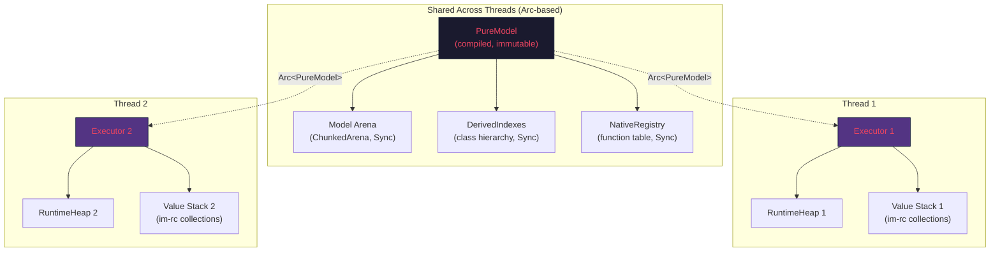

# Architectural Deep Questions

## Q1: How Will Chunk 0 (Bootstrap) Be Handled?

### What Java Does

The bootstrap is deeply unusual. The file `m3.pure` is NOT written in Pure syntax — it's written in **M4 syntax**, a lower-level notation that directly constructs graph nodes:

```m4
// m3.pure — this is NOT Pure syntax!
^Package Root
{
    Root.children[meta].children[pure].children[metamodel].children[ModelElement].properties[name] : 'Root',
    Package.properties[children] : []
}

^Package meta @Root.children
{
    Root.children[meta].children[pure].children[metamodel].children[ModelElement].properties[name] : 'meta',
    Package.properties[children] : [],
    Root.children[meta].children[pure].children[metamodel].children[PackageableElement].properties[package] : Root
}
```

This defines the M3 metamodel (Class, Property, Package, Function, Multiplicity, etc.) before those concepts exist in the system. It's a chicken-and-egg problem solved by using a lower-level language (M4) to bootstrap the higher-level one (M3/Pure).

The Java loading sequence in [PureRuntime.java:242-277](file:///Users/cocobey73/Projects/legend-pure/legend-pure-core/legend-pure-m3-core/src/main/java/org/finos/legend/pure/m3/serialization/runtime/PureRuntime.java#L242-L277):

```java
public RichIterable<Source> loadAndCompileCore(...) {
    // 1. Parse m3.pure with the M4 parser (not the M3/Pure parser!)
    Source m3Source = getOrLoadSource(M3_PURE);
    ModelRepository m3Repository = new ModelRepository();
    ListIterable<CoreInstance> results = new M4Parser()
        .parse(m3Source.getContent(), ...);
    
    // 2. Serialize and deserialize to intern into the main repository
    ListIterable<CoreInstance> newInstances = serializeAndDeserializeCoreInstances(...);
    
    // 3. Pre-compile the M3 instances (special pre-compile pass)
    this.getIncrementalCompiler().preCompileM3(newInstances);
    
    // 4. Now compile everything else (platform/*.pure) with the M3 parser
    this.compile(sources.reject(s -> M3_PURE.equals(s.getId())));
}
```

### Rust Strategy: Hardcode the M3 Metamodel

In Rust, we **don't need M4 syntax**. The M3 metamodel types are a fixed, known set that rarely changes:

```rust
/// The M3 metamodel is built-in, not parsed.
/// These are the "Chunk 0" types that exist before any Pure code is compiled.
pub fn bootstrap_model_arena() -> ModelArena {
    let mut arena = ModelArena::new();
    
    // Primitive types
    let string_id  = arena.intern_primitive("String");
    let integer_id = arena.intern_primitive("Integer");
    let float_id   = arena.intern_primitive("Float");
    let boolean_id = arena.intern_primitive("Boolean");
    let date_id    = arena.intern_primitive("Date");
    let decimal_id = arena.intern_primitive("Decimal");
    
    // Core M3 classes — these are known at compile time
    let any_id         = arena.intern_builtin_class("meta::pure::metamodel::type::Any", &[]);
    let nil_id         = arena.intern_builtin_class("meta::pure::metamodel::type::Nil", &[any_id]);
    let element_id     = arena.intern_builtin_class("meta::pure::metamodel::PackageableElement", &[any_id]);
    let type_id        = arena.intern_builtin_class("meta::pure::metamodel::type::Type", &[element_id]);
    let class_id       = arena.intern_builtin_class("meta::pure::metamodel::type::Class", &[type_id]);
    let function_id    = arena.intern_builtin_class("meta::pure::metamodel::function::Function", &[element_id]);
    let property_id    = arena.intern_builtin_class("meta::pure::metamodel::function::property::Property", &[function_id]);
    let package_id     = arena.intern_builtin_class("meta::pure::metamodel::Package", &[element_id]);
    let enum_id        = arena.intern_builtin_class("meta::pure::metamodel::type::Enumeration", &[type_id]);
    let multiplicity_id = arena.intern_builtin_class("meta::pure::metamodel::multiplicity::Multiplicity", &[any_id]);
    // ... Association, Measure, Unit, etc.
    
    // Build the Root package tree
    arena.build_root_package_tree();
    
    arena
}
```

**Why this works**: The M3 metamodel is stable. When it does change, it's a deliberate, version-bumped event. Hardcoding it in Rust means:
- No M4 parser needed  
- Zero startup cost for bootstrap  
- Type safety — the Rust compiler validates the metamodel structure  
- Any M3 change requires a Rust code update, which is acceptable since M3 changes are rare and versioned

> [!NOTE]
> The remaining `platform/*.pure` files (standard library functions like `map`, `filter`, `fold`, etc.) are still parsed and compiled from Pure source. Only the core metamodel types are hardcoded.

---

## Q2: Can PureModel Be Used on Multiple Threads with `im-rc`?

### The Problem

`im-rc` uses `Rc` (reference counting without atomics), which means `im_rc::Vector<Value>` and `im_rc::HashMap<Value, Value>` are **not `Send` or `Sync`**. This means `Value` cannot be sent across threads.

### The Solution: Separate Compiled Model from Runtime Execution



```rust
/// The compiled model — immutable, shared across threads via Arc.
/// Contains NO im-rc types.
pub struct PureModel {
    arena: ChunkedArena<Element>,     // Send + Sync ✓
    indexes: DerivedIndexes,          // Send + Sync ✓
    natives: NativeRegistry,          // Send + Sync ✓
    // No Value, no im-rc types here
}

// PureModel is Send + Sync because it contains no Rc types
unsafe impl Send for PureModel {}
unsafe impl Sync for PureModel {}

/// Per-thread execution context — NOT shared across threads.
/// Contains im-rc types.
pub struct Executor {
    model: Arc<PureModel>,            // Shared reference to compiled model
    heap: RuntimeHeap,                // Per-execution mutable state
    stack: VariableContext,           // Per-execution, contains im-rc Values
}
```

**The key insight**: `im-rc` types only appear in the `Executor`, which is per-thread. The `PureModel` is purely `Arc`-based and contains no `Rc` references. This is the standard Rust pattern for "shared immutable state + per-thread mutable state."

> [!TIP]
> If we ever need to share `Value` across threads (e.g., for parallel query execution), we can switch specific values to `im::Vector` (which uses `Arc` instead of `Rc`). The `Value` enum could even be generic over the pointer type, or we could have a `Value::into_thread_safe()` conversion.

---

## Q3: Polyglot Native Function Dispatch

### The Need

Some native functions can't be implemented in pure Rust:
- `legend::execute(plan)` — needs the Java plan execution engine  
- Database-specific SQL generation — may need Java JDBC drivers initially
- Python ML model evaluation — future
- WASM-based user-defined functions — future

### The Design: NativeRegistry with Runtime Backends

```rust
/// A native function implementation.
pub enum NativeImpl {
    /// Implemented directly in Rust — fastest path.
    Rust(fn(&mut Executor, &[Value]) -> Result<Value, PureError>),
    
    /// Dispatched to an external runtime environment.
    External {
        runtime: RuntimeEnvId,
        function_id: String,
    },
}

/// Registry of all runtime environments.
pub struct RuntimeEnvRegistry {
    envs: HashMap<RuntimeEnvId, Box<dyn RuntimeEnv>>,
}

/// Trait for external runtime environments.
pub trait RuntimeEnv: Send + Sync {
    fn name(&self) -> &str;
    
    /// Call a function in this runtime environment.
    fn call(
        &self, 
        function_id: &str, 
        args: &[Value],
        model: &PureModel,
    ) -> Result<Value, PureError>;
    
    /// Check if a function is available in this runtime.
    fn has_function(&self, function_id: &str) -> bool;
}

// ── Concrete Implementations ─────────────────────────

/// JNI bridge to Java runtime.
pub struct JavaRuntimeEnv {
    jvm: jni::JavaVM,
    /// Cache of Java method IDs for fast repeated dispatch.
    method_cache: HashMap<String, jni::objects::JMethodID>,
}

impl RuntimeEnv for JavaRuntimeEnv {
    fn name(&self) -> &str { "java" }
    
    fn call(&self, function_id: &str, args: &[Value], model: &PureModel) -> Result<Value, PureError> {
        let env = self.jvm.attach_current_thread()?;
        // Convert Rust Value → Java objects
        // Call Java method
        // Convert Java result → Rust Value
        todo!()
    }
    
    fn has_function(&self, function_id: &str) -> bool {
        // Check if the Java runtime has this function registered
        todo!()
    }
}

/// Python bridge (future).
pub struct PythonRuntimeEnv {
    // pyo3::Python handle
}

/// WASM bridge (future).
pub struct WasmRuntimeEnv {
    // wasmtime::Engine + Module
}
```

### Dispatch Flow

```rust
impl NativeRegistry {
    pub fn call(
        &self, 
        executor: &mut Executor,
        function_path: &str, 
        args: &[Value],
    ) -> Result<Value, PureError> {
        match self.lookup(function_path) {
            Some(NativeImpl::Rust(f)) => {
                // Fast path: direct Rust call
                f(executor, args)
            }
            Some(NativeImpl::External { runtime, function_id }) => {
                // Polyglot path: dispatch to external runtime
                let env = self.runtime_envs.get(runtime)
                    .ok_or(PureError::RuntimeNotFound(*runtime))?;
                env.call(function_id, args, &executor.model)
            }
            None => {
                Err(PureError::UnknownNativeFunction(function_path.to_string()))
            }
        }
    }
}
```

### Example: `legend::execute`

```rust
// During initialization:
registry.register(
    "meta::legend::execute_String_1__String_1__String_1_",
    NativeImpl::External {
        runtime: RuntimeEnvId::Java,
        function_id: "org.finos.legend.engine.plan.execution.PlanExecutor#execute".to_string(),
    },
);
```

> [!IMPORTANT]
> The JNI bridge requires careful value marshaling. The serialization format between Rust `Value` and Java `CoreInstance` should use the protocol JSON as an intermediate format — the same JSON the engine already uses for client↔server communication. This avoids building a bespoke binary protocol.

---

## Q4: Challenges in Unifying Legend-Pure and Engine Grammars

### How Java Does It

Java uses **`ServiceLoader<Parser>`** — a classpath-scanning mechanism that discovers grammar extensions at runtime:

```java
// ParserService.java — discovers parsers via ServiceLoader
public class ParserService {
    private final ServiceLoader<Parser> loader;
    
    public ListIterable<Parser> parsers() {
        return Lists.mutable.withAll(this.loader);
    }
}
```

Each `Parser` implementation handles a specific grammar section:

| Parser | Grammar Section | Repository |
|---|---|---|
| `M3AntlrParser` | Core Pure (`Class`, `Enum`, `Function`, etc.) | `platform` |
| `MappingParser` | `###Mapping` sections | `core` |
| `ConnectionParser` | `###Connection` sections | `core` |
| `RelationalParser` | `###Relational` sections | `core_relational` |
| `ServiceParser` | `###Service` sections | `core_service` |
| `FlatDataParser` | `###FlatData` sections | `core_flatdata` |

### Challenges for Rust

1. **Section-based parsing**: Engine files use `###SectionType` markers to switch grammars mid-file. The Rust parser currently handles Pure syntax only.

2. **No ServiceLoader equivalent**: Rust doesn't have classpath scanning. Need a different extensibility mechanism.

3. **Build-time vs runtime**: Java discovers parsers at runtime from classpath. Rust needs either compile-time feature flags or dynamic library loading.

### Rust Strategy: GrammarExtension Trait

```rust
/// Trait for grammar section parsers.
pub trait GrammarExtension: Send + Sync {
    /// The section marker this extension handles (e.g., "Mapping", "Connection").
    fn section_type(&self) -> &str;
    
    /// Parse a section body into AST nodes.
    fn parse_section(
        &self,
        source: &str,
        source_id: &str,
        offset: usize,
    ) -> Result<Vec<SectionElement>, ParseError>;
    
    /// Compose AST nodes back to source text.
    fn compose_section(
        &self,
        elements: &[SectionElement],
    ) -> Result<String, ComposeError>;
}

/// A Pure source file with mixed grammar sections.
pub struct SourceFile {
    /// Pure sections (classes, functions, etc.) — parsed by core parser
    pure_sections: Vec<PureSection>,
    /// Extension sections (###Mapping, ###Connection, etc.)
    extension_sections: Vec<ExtensionSection>,
}

pub struct ExtensionSection {
    section_type: String,        // "Mapping", "Connection", etc.
    raw_content: String,         // Unparsed section body
    parsed: Option<Vec<SectionElement>>, // Parsed lazily by extension
}
```

**Extensibility options**:

| Approach | Pros | Cons |
|---|---|---|
| **Feature flags** (compile-time) | Zero overhead, type-safe | Must recompile for new grammars |
| **Dynamic libraries** (`.dylib`/`.so`) | Hot-reload, no recompile | Unsafe FFI boundary, ABI fragility |
| **WASM plugins** | Sandboxed, portable | Performance overhead |
| **JNI passthrough** | Reuse existing Java parsers | Requires JVM, defeats purpose |

**Recommendation**: Start with **feature flags** for the core engine grammars (Mapping, Connection, Relational, Service). These are stable and well-known. Reserve dynamic loading for future user-defined DSLs.

> [!NOTE]
> The Pure core parser should treat `###SectionType` as opaque markers and store section bodies as raw strings. Grammar extensions parse them lazily. This means the core parser doesn't need to know about any engine-specific grammars — it just needs to recognize section boundaries.

---

## Q5: Executing Pure Code Through the Rust Runtime

### How Java Does It Now

Legend Engine has two execution modes:

1. **Interpreted** (`FunctionExecutionInterpreted`): Walks the AST/expression tree, evaluates node by node. Slow but flexible.

2. **Compiled** (`FunctionExecutionCompiled`): Transpiles Pure → Java bytecode, loads via `MemoryClassLoader`, executes as native JVM code. Fast but requires Java compilation step.

The engine primarily uses **compiled mode** — Pure functions are transpiled to Java classes:

```java
// FunctionExecutionCompiled.java
// Pure function → Java class → loaded → called via reflection
Object result = CompiledSupport.executeFunction(
    functionDefinition, paramClasses, params, executionSupport);
```

### The Challenge

Engine code does things like:

```java
// Somewhere in the engine
PureModel pureModel = ...; // compiled
CoreInstance function = pureModel.getConcreteFunctionDefinition("my::function", null);
FunctionExecution fe = new FunctionExecutionCompiled();
fe.start(function, arguments); // executes compiled Java
```

If we replace the interpreter with Rust, the engine (still running in Java) needs a way to call Rust Pure execution.

### Rust Strategy: Dual-Mode via JNI Facade

```
┌─────────────────────────────────────────────────┐
│                 Legend Engine (Java)              │
│                                                   │
│  PureModel.compile()                              │
│       ↓                                           │
│  [Option A: Java compiled mode — existing path]   │
│  [Option B: Rust runtime via JNI — new path]      │
│       ↓                                           │
│  RustPureRuntime.execute(functionPath, args)       │
│       ↓ (JNI)                                     │
│  ┌─────────────────────────────────────────────┐  │
│  │           Rust Pure Runtime (via JNI)        │  │
│  │                                               │  │
│  │  1. Receive function path + serialized args   │  │
│  │  2. Look up function in PureModel             │  │
│  │  3. Execute via Rust interpreter              │  │
│  │  4. Serialize result back to Java             │  │
│  └─────────────────────────────────────────────┘  │
└─────────────────────────────────────────────────┘
```

```rust
/// JNI entry point — called from Java
#[no_mangle]
pub extern "system" fn Java_org_finos_legend_pure_runtime_rust_RustRuntime_execute(
    env: JNIEnv,
    _class: JClass,
    model_ptr: jlong,           // Pointer to Arc<PureModel>
    function_path: JString,     // "meta::pure::functions::string::toString_Any_1__String_1_"
    args_json: JString,         // Protocol JSON serialized arguments
) -> jstring {
    let model: &Arc<PureModel> = unsafe { &*(model_ptr as *const Arc<PureModel>) };
    let func_path: String = env.get_string(function_path).unwrap().into();
    let args: Vec<Value> = deserialize_args(env.get_string(args_json).unwrap());
    
    let mut executor = Executor::new(Arc::clone(model));
    match executor.evaluate_function(&func_path, &args) {
        Ok(result) => serialize_result_to_json(&result),
        Err(e) => throw_pure_execution_exception(env, &e),
    }
}
```

### Migration Path

| Phase | Engine Uses | Pure Execution | Notes |
|---|---|---|---|
| **Phase 1: Coexistence** | Java compiled mode | Java (existing) | Rust parser provides AST/protocol JSON |
| **Phase 2: JNI Bridge** | Java compiled mode + Rust for specific functions | Mixed | Rust handles specific Pure eval requests via JNI |
| **Phase 3: Rust-First** | Rust runtime via JNI | Rust (primary) | Java compiled mode as fallback |
| **Phase 4: Full Rust** | Rust native engine | Rust | Engine itself ported or replaced |

> [!WARNING]
> **The compiled Java code path cannot be fully replaced overnight.** The Java compiled mode generates ~100K+ lines of Java code from Pure sources. The Rust interpreter handles the same semantics but via tree-walking, which is slower than JIT-compiled Java. The practical migration path is to use Rust for **new functionality** (Relation, new features) while keeping Java compiled mode for hot paths until the Rust runtime proves equivalent performance.

### A Pragmatic Alternative: Rust as Compiler Backend

Instead of tree-walking interpretation, Rust could also serve as **a new compiler backend** that generates optimized Rust/LLVM IR instead of Java bytecode:

```
Pure Source → Rust Parser → AST → Rust Compiler → LLVM IR → Native Code
```

This would give us Java compiled-mode performance without Java. But this is a much larger undertaking than the interpreter approach.
