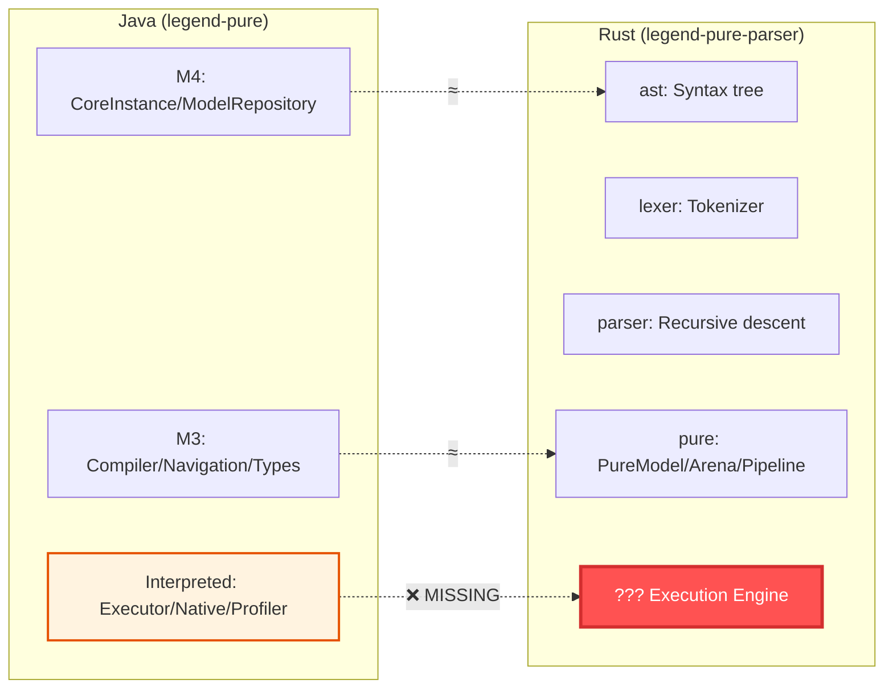
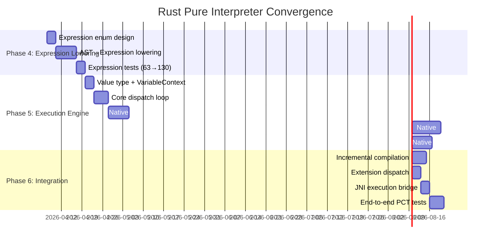

# Convergence Analysis: Rust Pure ↔ Java Pure Interpreter

This document analyzes the architectural gap between the **Rust `legend-pure-parser`** crate workspace and the **Java `legend-pure` interpreter** (`legend-pure-runtime-java-engine-interpreted`), and charts the path for the Rust implementation to converge as a functionally equivalent Pure language interpreter.

---

## Executive Summary

The Rust implementation currently covers **parser + semantic compilation** (Phases 0–3 of a 6-phase pipeline). To reach parity with the Java interpreter, three major subsystems remain:

1. **Expression Lowering** — The `Expression` type is a placeholder; no AST expressions are lowered to the semantic graph
2. **Execution Engine** — No interpreter exists; the Java engine is ~1,100 lines of core dispatch + 173 native function implementations
3. **Runtime Services** — No variable context, profiling, incremental compilation, or output writer

> [!IMPORTANT]
> The Rust codebase has made several **deliberate architectural improvements** over Java (arena/index pattern, unidirectional data, no Generalization node). These should be **preserved** during convergence — the goal is functional parity, not structural mimicry.

---

## Architectural Mapping

### Layer-by-Layer Correspondence



### Detailed Component Mapping

| Java Component | Rust Equivalent | Status | Gap |
|---|---|---|---|
| **M4: `CoreInstance`** | `ElementId` + `Arena<Element>` + `Arena<ElementNode>` | ✅ Improved | Arena/index replaces stringly-typed `CoreInstance` |
| **M4: `ModelRepository`** | `PureModel` | ✅ Improved | Global packages + chunked elements |
| **M3: `ProcessorSupport`** | `ResolutionContext` | ⚠️ Partial | Covers type resolution but not runtime navigation |
| **M3: Type hierarchy** | `TypeExpr`, `PrimitiveType`, bootstrap | ✅ Complete | `TypeExpr` ≈ Java's `GenericType` |
| **M3: `Multiplicity`** | `types::Multiplicity` | ✅ Complete | Enum with semantic variants |
| **M3: Compiler passes** | `pipeline.rs` (Pass 1–3) | ⚠️ Partial | Declaration + topo sort + definition done; expression lowering deferred |
| **M3: `Generalization`** | Eliminated | ✅ Improved | Direct `Vec<ElementId>` + derived index |
| **Interpreted: `FunctionExecutionInterpreted`** | — | ❌ Missing | The core interpreter dispatch loop |
| **Interpreted: `Executor` interface** | — | ❌ Missing | `FunctionExpressionExecutor`, `InstanceValueExecutor`, etc. |
| **Interpreted: `NativeFunction`** (173 impls) | — | ❌ Missing | `plus`, `minus`, `filter`, `map`, `if`, `cast`, etc. |
| **Interpreted: `VariableContext`** | — | ❌ Missing | Scoped variable bindings with parent chaining |
| **Interpreted: `InstantiationContext`** | — | ❌ Missing | Object creation tracking |
| **Interpreted: `Profiler`** | — | ❌ Missing | Execution profiling |
| **Interpreted: `ExecutionSupport`** | — | ❌ Missing | Runtime support services |
| **Interpreted: `InterpretedExtension`** | `CompilerExtension` (trait exists) | ⚠️ Scaffold | Trait defined but no runtime dispatch |

---

## Gap Analysis by Subsystem

### 1. Expression Lowering (Phase 4)

This is the **single largest gap** and the foundation for everything else.

**Current state:** The `Expression` type in [types.rs](file:///Users/cocobey73/Projects/legend-engine/legend-pure-parser/crates/pure/src/types.rs#L152-L157) is a 2-field placeholder:

```rust
pub struct Expression {
    pub source_info: SourceInfo,
    // TODO: Phase 4+ — recursive enum mirroring ast::Expression
    // with all names resolved to ElementIds.
}
```

**Required:** A recursive `Expression` enum that mirrors `ast::Expression` but with all names resolved to `ElementId`s. The Java equivalent is `ValueSpecification` with its subclasses: `FunctionExpression`, `InstanceValue`, `VariableExpression`, `SimpleFunctionExpression`.

**Proposed Design:**

```rust
pub enum Expression {
    /// Literals: 42, "hello", true, %2024-01-01
    Literal { value: LiteralValue, source_info: SourceInfo },
    /// Variable reference: $x
    Variable { name: SmolStr, source_info: SourceInfo },
    /// Property access: $this.name
    PropertyAccess {
        object: Box<Expression>,
        property: SmolStr,
        owner_id: ElementId,  // resolved class/association
        source_info: SourceInfo,
    },
    /// Function call: foo(a, b) — resolved to concrete function
    FunctionApplication {
        function: ElementId,  // resolved function
        arguments: Vec<Expression>,
        source_info: SourceInfo,
    },
    /// Arrow: $x->filter(e | e.age > 18)
    ArrowApplication {
        target: Box<Expression>,
        function: ElementId,
        arguments: Vec<Expression>,
        source_info: SourceInfo,
    },
    /// Lambda: {x: String[1] | $x + '!'}
    Lambda {
        parameters: Vec<Parameter>,
        body: Vec<Expression>,
        source_info: SourceInfo,
    },
    /// Let binding: let x = expr; ...
    Let {
        name: SmolStr,
        value: Box<Expression>,
        source_info: SourceInfo,
    },
    /// Collection: [1, 2, 3]
    Collection {
        elements: Vec<Expression>,
        source_info: SourceInfo,
    },
    /// Instance creation: ^Person(name='John')
    NewInstance {
        class_id: ElementId,
        key_expressions: Vec<(SmolStr, Expression)>,
        source_info: SourceInfo,
    },
    /// Cast: $x->cast(@Person)
    Cast {
        expression: Box<Expression>,
        target_type: TypeExpr,
        source_info: SourceInfo,
    },
    // Arithmetic, Boolean, Comparison → desugared to FunctionApplication
    // (unlike the AST which preserves syntax, the semantic layer normalizes)
}
```

> [!WARNING]
> The DESIGN.md explicitly says **"Don't desugar expressions"** to enable future Pure→AST emission. This means `Arithmetic`, `Boolean`, `Comparison` should remain as distinct variants, NOT be desugared to `FunctionApplication`. This is a **deliberate divergence** from the Java interpreter which normalizes everything to `FunctionExpression`.

---

### 2. Execution Engine (Phase 5)

The Java interpreter has a clear execution architecture:

```
FunctionExecutionInterpreted.executeFunction()
  ├── NativeFunction?  → delegates to NativeFunction.execute()
  ├── Property?        → executeProperty()
  └── FunctionDefinition? → walk expressionSequence, evaluate each
        ├── FunctionExpressionExecutor (resolves types, evaluates params, recurses)
        ├── InstanceValueExecutor (returns literal values)
        ├── VariableExpressionExecutor (looks up VariableContext)
        └── (extension executors)
```

**Proposed Rust equivalent:**

| Java Class | Rust Equivalent | Notes |
|---|---|---|
| `FunctionExecutionInterpreted` | `Engine` struct | Core dispatch loop |
| `Executor` interface | `fn execute(expr, ctx) -> Value` | Single trait or match on `Expression` |
| `VariableContext` | `VariableContext` (linked scopes) | Parent-chaining with scope boundaries |
| `NativeFunction` | `trait NativeFunction` + registry | HashMap\<SmolStr, Box\<dyn NativeFunction\>\> |
| `InstantiationContext` | `InstantiationContext` | Object creation tracking |
| `CoreInstance` (runtime values) | `Value` enum | `Literal`, `Instance`, `Collection`, `Lambda` |

**Key design decision** for the Rust engine: should runtime values be `CoreInstance`-style (generic, stringly-typed) or strongly-typed? The strongly-typed approach aligns better with Rust:

```rust
/// Runtime value — the result of evaluating an Expression.
pub enum Value {
    Integer(i64),
    Float(f64),
    Decimal(BigDecimal),
    Boolean(bool),
    String(SmolStr),
    Date(PureDate),
    StrictDate(PureStrictDate),
    DateTime(PureDateTime),
    Nil,
    Collection(Vec<Value>),
    Instance(InstanceValue),  // class instance with property map
    Lambda(LambdaValue),      // closure with captured variables
    EnumValue { enum_id: ElementId, value_name: SmolStr },
    Type(ElementId),          // reified type
}
```

---

### 3. Native Function Registry

The Java interpreter registers **173 native functions** across these categories:

| Category | Count | Examples |
|---|---|---|
| **Boolean** | 8 | `and`, `or`, `not`, `eq`, `equal`, `is`, `lessThan`, `lessThanEqual` |
| **Collection** | 35 | `filter`, `map`, `fold`, `sort`, `exists`, `forAll`, `first`, `at`, `size`, `add`, `concatenate` |
| **Collection/Map** | 12 | `newMap`, `get`, `put`, `keys`, `values`, `keyValues`, `groupBy` |
| **Math** | 28 | `plus`, `minus`, `times`, `divide`, `abs`, `mod`, `pow`, `sqrt`, `sin`, `cos`, `round`, `floor`, `ceiling` |
| **String** | 20 | `joinStrings`, `contains`, `startsWith`, `endsWith`, `length`, `substring`, `replace`, `split`, `trim`, `toLower` |
| **Date** | 16 | `date()`, `datePart`, `year`, `month`, `dayOfMonth`, `adjust`, `dateDiff`, `hasDay`, `hasMonth` |
| **Lang** | 25 | `if`, `match`, `let`, `new`, `copy`, `cast`, `eval`, `dynamicNew`, `getAll`, `toOne` |
| **Meta** | 17 | `genericType`, `instanceOf`, `subTypeOf`, `elementToPath`, `pathToElement`, `id`, `stereotype`, `tag` |
| **String Parse** | 6 | `parseBoolean`, `parseDate`, `parseFloat`, `parseDecimal`, `parseInteger` |
| **Tests** | 2 | `assert`, `assertError` |
| **IO** | 1 | `print` |
| **Other** | 3 | `random`, `deactivate`, `reactivate` |

Each native function in Java implements:
```java
CoreInstance execute(ListIterable<? extends CoreInstance> params,
                    Stack<MutableMap<String, CoreInstance>> resolvedTypeParameters,
                    Stack<MutableMap<String, CoreInstance>> resolvedMultiplicityParameters,
                    VariableContext variableContext,
                    MutableStack<CoreInstance> functionExpressionCallStack,
                    Profiler profiler,
                    InstantiationContext instantiationContext,
                    ExecutionSupport executionSupport,
                    Context context,
                    ProcessorSupport processorSupport);
```

**Rust equivalent trait:**

```rust
pub trait NativeFunction: Send + Sync {
    fn execute(
        &self,
        args: &[Value],
        ctx: &mut ExecutionContext<'_>,
    ) -> Result<Value, ExecutionError>;

    /// If true, parameter evaluation is deferred (for `if`, `and`, `or`)
    fn defer_parameter_execution(&self) -> bool { false }
}
```

---

### 4. Type Inference & Parametric Polymorphism

The Java interpreter handles type parameter resolution at runtime via a `Stack<MutableMap<String, CoreInstance>>` for resolved type parameters. This is visible in `FunctionExpressionExecutor.resolveLocalTypeAndMultiplicityParams()`.

The Rust `pure` crate has `TypeExpr::Generic(SmolStr)` for unresolved type variables but no runtime resolution mechanism. This needs:

- A `TypeEnvironment` that maps type parameter names → concrete `TypeExpr`
- Resolution during function call dispatch (push/pop on a stack, like Java)
- Multiplicity parameter resolution (the Java code has a parallel stack for multiplicities)

---

## Convergence Roadmap



### Phase 4: Expression Lowering (est. ~2 weeks)

| Step | Description | Validation |
|---|---|---|
| 4.1 | Define `Expression` enum in `types.rs` (recursive, non-desugared) | Compiles, all existing tests pass |
| 4.2 | Implement `lower_expression()` in `resolve.rs` / new `expression.rs` | AST→Expression for all 16 expression variants |
| 4.3 | Wire into `hydrate_element()` — replace placeholder bodies | Function bodies, constraint expressions, qualified property bodies, default values |
| 4.4 | Add snapshot tests for expression trees | ~30 new test cases covering arithmetic, boolean, lambda, let, cast, newInstance |

### Phase 5: Execution Engine (est. ~4 weeks)

| Step | Description | Validation |
|---|---|---|
| 5.1 | Define `Value` enum, `VariableContext`, `ExecutionContext` | Unit tests for variable scoping |
| 5.2 | Implement `Engine::execute()` dispatch loop | Can evaluate literal expressions |
| 5.3 | **Grammar Natives** (~30): `plus`, `minus`, `times`, `divide`, `and`, `or`, `not`, `eq`, `lessThan`, `filter`, `map`, `first`, `size`, `isEmpty`, `if`, `match`, `let`, `new`, `joinStrings`, `toOne`, `toOneMany`, `copy`, `extractEnumValue`, `getAll`, `range`, `compare`, `cast` | Can run basic Pure functions |
| 5.4 | **Essential Natives** (~80): Collection (fold, sort, exists, forAll, find, drop, take, slice, tail, add, concatenate, removeDuplicates, zip, reverse, at, indexOf), Math (abs, mod, rem, pow, sqrt, cbrt, exp, log, ceiling, floor, round, sin, cos, tan, etc.), String (contains, startsWith, endsWith, substring, replace, split, toLower, toUpper, trim, length, indexOf, format, toString), Date (date constructors, year, month, day, hour, adjust, dateDiff, has*), Meta (genericType, instanceOf, subTypeOf, elementToPath, pathToElement, stereotypes, tags, generalizations), Lang (dynamicNew, eval, evaluate, rawEvalProperty, getUnitValue, newUnit, toDecimal, toFloat), IO (print), Tests (assert, assertError) | PCT Grammar+Essential pass |
| 5.5 | **Extension Natives** (~63): Map (newMap, get, put, keys, values, keyValues, groupBy, putAll, replaceAll, getIfAbsentPutWithKey, getMapStats), Tree (replaceTreeNode), Reactivation (deactivate, evaluateAndDeactivate, reactivate, canReactivateDynamically, openVariableValues), Source (sourceInformation), Parse (parseBoolean, parseDate, parseFloat, parseDecimal, parseInteger), Multiplicity (toMultiplicity), Relation (addColumns) | Full PCT pass |

### Phase 6: Integration (est. ~2 weeks)

| Step | Description | Validation |
|---|---|---|
| 6.1 | Incremental compilation (dirty tracking, partial recompilation) | Edit-recompile cycle works |
| 6.2 | `InterpretedExtension` runtime dispatch | Plugin extensions execute |
| 6.3 | JNI bridge: `execute()` entry point | Java can call Rust parser+interpreter |
| 6.4 | End-to-end PCT tests against Java reference | ≥95% pass rate |

---

## Risk Assessment

| Risk | Severity | Mitigation |
|---|---|---|
| **Expression desugaring decision** — The Java interpreter normalizes `a + b` to `plus(a, b)` at compile time; DESIGN.md says don't desugar | High | Execute non-desugared expressions directly; the dispatch loop matches on `Arithmetic` etc. and calls the same native |
| **Type parameter resolution at runtime** — Complex stack-based resolution with `makeTypeArgumentAsConcreteAsPossible` | High | Implement incrementally; start with monomorphic functions, add generics later |
| **173 native functions** — Large surface area | Medium | Prioritize by PCT test coverage; grammar tier alone unlocks ~60% of test coverage |
| **Cyclic lambda closures** — Java's `LambdaWithContext` captures variable scope | Medium | Rust's `Value::Lambda` carries captured `VariableContext` snapshot |
| **`CoreInstance` flexibility** — Java uses stringly-typed property access everywhere | Low | Strongly-typed `Value` enum is better but requires careful mapping at JNI boundary |

---

## Architectural Advantages to Preserve

These Rust improvements are **superior** to the Java architecture and must be maintained during convergence:

1. **Arena/Index pattern** — No `Rc<RefCell<>>` or reference cycles. The `PureModel` is trivially serializable and parallel-read safe.

2. **Unidirectional data + derived indexes** — Eliminates 5 Java bidirectional mutation patterns. The `DerivedIndexes` struct replaces `_specializationsAdd()`, `_propertiesFromAssociationsAdd()`, etc.

3. **No `Generalization` node** — Direct `Vec<ElementId>` for supertypes + inverted index for specializations. Eliminates an entire class hierarchy.

4. **Strongly-typed `Element` enum** — Rust `match` exhaustiveness replaces Java's `instanceof` chains (`CoreInstance` → cast → access).

5. **Segmented `ElementId(chunk_id, local_idx)`** — Zero-rewrite model merging. Java's model requires global re-indexing.

6. **`TypeExpr` vs `GenericType`** — Rust enum with 5 variants vs Java class hierarchy with wrapper objects.

7. **Freeze-then-query lifecycle** — No aliased mutation. The `PureModel` is immutable after construction, enabling fearless parallelism.

---

## Coverage Matrix: What Can Be Tested Today vs. After Convergence

| Capability | Status Today | After Phase 4 | After Phase 5 | After Phase 6 |
|---|---|---|---|---|
| Parse `.pure` → AST | ✅ | ✅ | ✅ | ✅ |
| AST → Protocol JSON | ✅ | ✅ | ✅ | ✅ |
| Protocol JSON backward compat | ✅ | ✅ | ✅ | ✅ |
| Compile AST → `PureModel` (types) | ✅ | ✅ | ✅ | ✅ |
| Compile AST → `PureModel` (expressions) | ❌ Placeholder | ✅ | ✅ | ✅ |
| Evaluate Pure expressions | ❌ | ❌ | ✅ | ✅ |
| Execute Pure functions | ❌ | ❌ | ✅ | ✅ |
| Run PCT test suite | ❌ | ❌ | ⚠️ Grammar+Essential | ✅ |
| Incremental compilation | ❌ | ❌ | ❌ | ✅ |
| JNI interop (Java → Rust execution) | ❌ | ❌ | ❌ | ✅ |

---

## Immediate Next Steps

1. **Finalize `Expression` enum design** — Decide on desugaring vs. non-desugaring (recommendation: keep non-desugared, match Java's normalization only in the dispatch layer)
2. **Implement `lower_expression()`** — This is the critical unlock; everything else depends on it
3. **Define `Value` enum** — The runtime value representation
4. **Implement basic dispatch** — `if`, `let`, `plus`, `eq` — enough to run the simplest Pure function
5. **Set up PCT test harness** — Run the Java PCT tests against the Rust interpreter for continuous convergence tracking

> [!TIP]
> The **compose** crate (AST → text emission) and **protocol** crate (AST ↔ JSON) are already complete. The convergence work is entirely in the `pure` crate, with a new `interpreter` crate (or module) for the execution engine.
