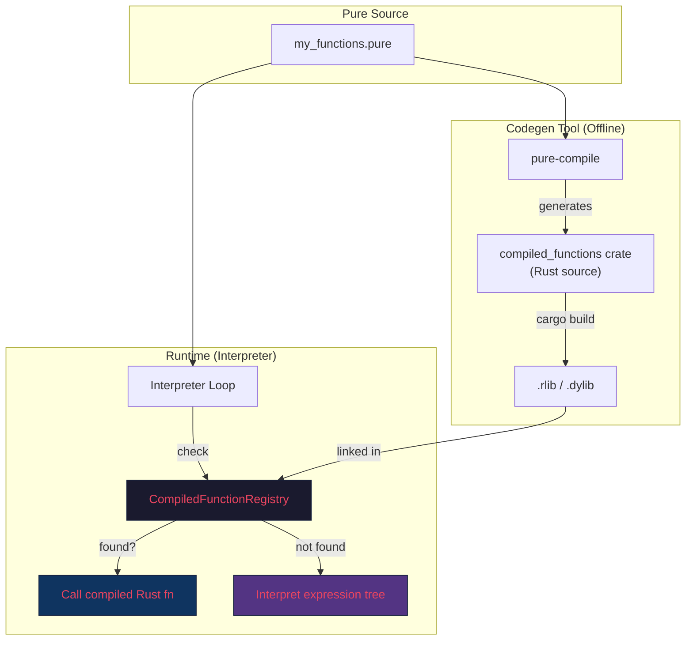
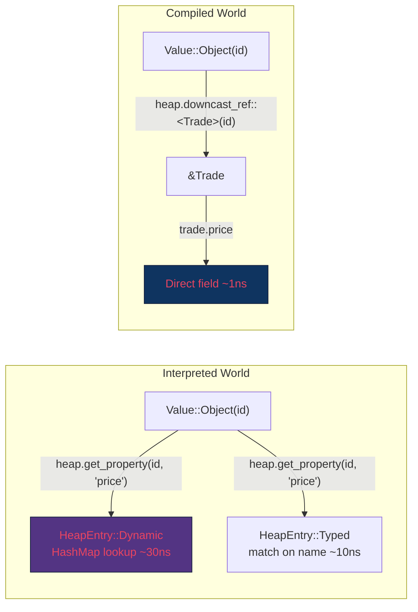

# Hybrid Interpreter + Compiled Rust Architecture

## The Idea

The Rust interpreter always works. But for **hot Pure functions**, a separate codegen tool generates **native Rust code** into a crate. If that crate is linked in, the interpreter delegates to it — direct Rust function calls, zero interpretation overhead. If not, it falls back to interpreting.

This is the same strategy as:
- **CPython + C extensions** (numpy is C, but Python calls it seamlessly)
- **LuaJIT + FFI** (Lua interpreter + native C calls)
- **Java compiled mode** (but Rust instead of Java, and ahead-of-time instead of JIT)

> [!NOTE]
> Since Java is moving to HAMT (vavr) for collection operations, the O(N²)→O(N log N) advantage becomes shared. The hybrid approach recovers the per-operation performance gap, making Rust competitive with JIT-compiled Java even on tight arithmetic loops.

---

## Architecture Overview



---

## Core Design

### The CompiledFunction Trait

```rust
use crate::runtime::{Executor, Value, PureError};

/// A Pure function compiled to native Rust.
/// This is the bridge between the interpreter and compiled code.
pub trait CompiledFunction: Send + Sync {
    /// The Pure function path this implements.
    /// e.g., "my::package::computeTotal_Trade_MANY__Float_1_"
    fn function_id(&self) -> &str;
    
    /// Execute with the given arguments.
    /// The Executor provides access to:
    ///   - model: Arc<PureModel> (class definitions, etc.)
    ///   - heap: RuntimeHeap (for mutateAdd, object creation)
    ///   - natives: NativeRegistry (for calling other functions)
    fn call(&self, executor: &mut Executor, args: &[Value]) -> Result<Value, PureError>;
}
```

### The Registry

```rust
pub struct CompiledFunctionRegistry {
    /// Map from Pure function path → compiled implementation.
    functions: HashMap<SmolStr, Box<dyn CompiledFunction>>,
}

impl CompiledFunctionRegistry {
    /// Register all functions from a compiled crate.
    pub fn register_crate(&mut self, crate_functions: Vec<Box<dyn CompiledFunction>>) {
        for f in crate_functions {
            self.functions.insert(SmolStr::from(f.function_id()), f);
        }
    }
    
    /// Look up a compiled version of a function.
    pub fn get(&self, function_id: &str) -> Option<&dyn CompiledFunction> {
        self.functions.get(function_id).map(|f| f.as_ref())
    }
}
```

### The Interpreter Dispatch (Modified)

```rust
impl Executor {
    pub fn evaluate_function(
        &mut self,
        function_id: &str,
        args: &[Value],
    ) -> Result<Value, PureError> {
        // Priority 1: Native Rust functions (built-in)
        if let Some(native) = self.model.natives.get(function_id) {
            return native.call(self, args);
        }
        
        // Priority 2: Compiled Pure functions (generated crate)
        if let Some(compiled) = self.compiled.get(function_id) {
            return compiled.call(self, args);
        }
        
        // Priority 3: Interpret from expression tree
        let func_def = self.model.lookup_function(function_id)?;
        self.interpret_expression_sequence(&func_def.body, args)
    }
}
```

**Three tiers, seamless fallback.** The caller doesn't know which path was taken.

---

## What Generated Code Looks Like

### Pure Source

```pure
function my::analytics::computeVWAP(trades: Trade[*]): Float[1] {
    let totalNotional = $trades->map(t | $t.price * $t.quantity)->sum();
    let totalQuantity = $trades->map(t | $t.quantity)->sum();
    $totalNotional / $totalQuantity;
}
```

### Generated Rust (by `pure-compile` tool)

```rust
// AUTO-GENERATED by pure-compile — do not edit
// Source: my/analytics/functions.pure
// Function: my::analytics::computeVWAP_Trade_MANY__Float_1_

use legend_pure_runtime::prelude::*;

pub struct ComputeVWAP;

impl CompiledFunction for ComputeVWAP {
    fn function_id(&self) -> &str {
        "my::analytics::computeVWAP_Trade_MANY__Float_1_"
    }
    
    fn call(&self, executor: &mut Executor, args: &[Value]) -> Result<Value, PureError> {
        // args[0] = trades: Collection of Trade objects
        let trades = args[0].as_collection()?;
        
        let mut total_notional: f64 = 0.0;
        let mut total_quantity: f64 = 0.0;
        
        for trade in trades.iter() {
            let obj_id = trade.as_object()?;
            let price = executor.heap.get_property(obj_id, "price")?
                .as_float()?;
            let quantity = executor.heap.get_property(obj_id, "quantity")?
                .as_float()?;
            
            total_notional += price * quantity;
            total_quantity += quantity;
        }
        
        Ok(Value::Float(total_notional / total_quantity))
    }
}

/// Entry point called by the registry to discover functions in this crate.
pub fn register() -> Vec<Box<dyn CompiledFunction>> {
    vec![
        Box::new(ComputeVWAP),
    ]
}
```

### Key Observations

1. **No interpretation overhead**: Direct Rust `f64` arithmetic, loop over collection
2. **Still uses `Executor`**: Can access the `RuntimeHeap`, call other functions
3. **The boundary is `Value`**: Arguments come in as `Value`, results go out as `Value`
4. **Property access uses heap**: `executor.heap.get_property()` — same path as interpreted code
5. **Compiled code can call interpreted code**: Via `executor.evaluate_function()`

---

## Compiled ↔ Interpreted Interop

The most important design point: compiled and interpreted code **can call each other freely**.

```rust
impl CompiledFunction for MyCompiledFn {
    fn call(&self, executor: &mut Executor, args: &[Value]) -> Result<Value, PureError> {
        // This compiled function calls another Pure function.
        // If that function is also compiled → direct Rust call.
        // If not → interpreted seamlessly.
        let intermediate = executor.evaluate_function(
            "other::package::helper_String_1__Integer_1_",
            &[Value::String("hello".into())]
        )?;
        
        // Use the result
        let n = intermediate.as_integer()?;
        Ok(Value::Integer(n * 2))
    }
}
```

```
Call graph with mixed compilation:

  computeVWAP (compiled) 
    → trades.map(t | t.price * t.quantity)  (compiled — inlined in loop)
    → sum()                                  (native — built-in)
    → helper()                               (interpreted — no compiled version)
    → divide                                 (compiled — arithmetic)
```

**Each call re-enters the dispatch table.** Compiled code never assumes other functions are compiled — it always goes through `executor.evaluate_function()`, which checks all three tiers.

---

## The Calling Convention

### Value-Based Boundary

```
                    ┌───────────────────┐
  Interpreter ──→   │    Value enum     │  ──→ Compiled Function
                    │                   │
  args: &[Value]   │  Boolean(bool)    │   args: &[Value]
  return: Value     │  Integer(i64)    │   return: Value
                    │  Float(f64)      │
                    │  String(SmolStr) │
                    │  Collection(PV)  │
                    │  Object(ObjectId)│
                    │  Relation(Box)   │
                    └───────────────────┘
```

**No marshaling needed.** Both interpreted and compiled code use the same `Value` enum. The boundary cost is zero — it's just a function call with `&[Value]` arguments.

This is fundamentally different from JNI (which requires expensive Java↔native marshaling) or Python C extensions (which require PyObject wrapping/unwrapping).

### Optimization: Unboxed Specialization

For hot inner loops, the codegen can optimize past the `Value` boundary:

```rust
// Generated: specialized for Float arguments, avoids Value::match per iteration
impl CompiledFunction for SumFloats {
    fn call(&self, executor: &mut Executor, args: &[Value]) -> Result<Value, PureError> {
        let collection = args[0].as_collection()?;
        
        // Fast path: if all elements are Float, avoid per-element match
        let mut sum: f64 = 0.0;
        for v in collection.iter() {
            match v {
                Value::Float(f) => sum += f,
                Value::Integer(i) => sum += *i as f64,
                _ => return Err(PureError::type_error("Float", v)),
            }
        }
        Ok(Value::Float(sum))
    }
}
```

The `match` on each element is ~2ns. For truly hot paths, the codegen could even **specialize the collection type** to avoid the match entirely (store typed arrays alongside the PVector).

---

## Crate Discovery: Three Models

### Model A: Static Linking (Recommended to Start)

```toml
# Cargo.toml of the runtime
[dependencies]
legend-pure-runtime = "0.1"

# Optional: compiled Pure functions for your project
my-project-compiled = { path = "../generated/my-project-compiled", optional = true }
```

```rust
// main.rs — runtime initialization
fn build_executor(model: Arc<PureModel>) -> Executor {
    let mut compiled = CompiledFunctionRegistry::new();
    
    // If the compiled crate is linked in, register its functions
    #[cfg(feature = "my-project-compiled")]
    compiled.register_crate(my_project_compiled::register());
    
    Executor::new(model, compiled)
}
```

**Pros**: Zero runtime overhead, no unsafe code, normal Cargo dependency  
**Cons**: Requires recompilation to swap compiled functions

### Model B: Dynamic Loading (Future)

```rust
// Load compiled functions from a shared library at runtime
let lib = libloading::Library::new("./compiled_functions.dylib")?;
let register: libloading::Symbol<fn() -> Vec<Box<dyn CompiledFunction>>> = 
    unsafe { lib.get(b"register")? };
compiled.register_crate(register());
```

**Pros**: Hot-reload, no recompilation of the runtime  
**Cons**: Requires `unsafe`, ABI stability concerns, platform-specific

### Model C: WASM Modules (Future)

```rust
// Load compiled functions as WASM modules
let engine = wasmtime::Engine::new(&config)?;
let module = wasmtime::Module::from_file(&engine, "compiled_functions.wasm")?;
// ... instantiate and register
```

**Pros**: Sandboxed, portable, user-uploadable  
**Cons**: Performance overhead (~2x vs native), limited interop

---

## The Codegen Pipeline

```
┌──────────────┐     ┌──────────────┐     ┌──────────────┐     ┌──────────────┐
│  Pure Source  │ ──→ │  Rust Parser  │ ──→ │  Pure AST    │ ──→ │  Codegen     │
│  (.pure)     │     │  (existing)  │     │              │     │  (new tool)  │
└──────────────┘     └──────────────┘     └──────────────┘     └──────┬───────┘
                                                                       │
                                          ┌──────────────┐             │
                                          │  Rust Source  │ ←──────────┘
                                          │  (.rs files)  │
                                          └──────┬───────┘
                                                 │
                                          ┌──────▼───────┐
                                          │  cargo build  │
                                          │  (standard)   │
                                          └──────┬───────┘
                                                 │
                                          ┌──────▼───────┐
                                          │  .rlib/.dylib │
                                          │  (native)     │
                                          └──────────────┘
```

### CLI Integration

```bash
# Step 1: Compile Pure to Rust
$ legend compile-native \
    --sources ./src/main/pure/ \
    --output ./generated/compiled_functions/ \
    --functions "my::analytics::*"   # optionally filter which functions to compile

# Step 2: Build the generated crate
$ cd generated/compiled_functions && cargo build --release

# Step 3: Run with compiled functions linked in
$ legend run --compiled ./generated/compiled_functions/target/release/libcompiled.dylib \
    --evaluate "my::analytics::computeVWAP(loadTrades())"
```

---

## What Gets Compiled vs Interpreted

Not all Pure code benefits from compilation. The codegen tool should target:

### Good Candidates for Compilation ✅

| Pattern | Why |
|---|---|
| **Arithmetic-heavy functions** | Eliminates match-per-op overhead |
| **Tight loops** (`fold`, `map` over large collections) | Loop body becomes native code |
| **String manipulation** | Direct SmolStr operations |
| **Pure data transformations** | No heap interaction, pure computation |
| **Frequently-called utility functions** | Amortizes codegen cost |

### Poor Candidates (Keep Interpreted) ❌

| Pattern | Why |
|---|---|
| **Functions using `mutateAdd`** | Complex heap interaction, hard to optimize |
| **Metaprogramming** (`deactivate`/`reactivate`) | Dynamic expression evaluation |
| **Rarely-called setup functions** | Codegen cost > execution savings |
| **Functions that change frequently** | Recompilation overhead |

### Automatic Tier Selection (Future)

```rust
/// Profiling data collected during interpretation.
pub struct FunctionProfile {
    call_count: u64,
    total_time_ns: u64,
    avg_collection_size: usize,
}

impl Executor {
    /// After profiling, suggest which functions to compile.
    pub fn suggest_compilation_targets(&self) -> Vec<(String, FunctionProfile)> {
        self.profiles.iter()
            .filter(|(_, p)| p.call_count > 1000 && p.total_time_ns > 1_000_000)
            .sorted_by(|(_, a), (_, b)| b.total_time_ns.cmp(&a.total_time_ns))
            .collect()
    }
}
```

---

## Performance Expectations

```
Java Compiled (JIT):     ██████████████████████████ 100% (baseline)
Rust Compiled (AOT):     ████████████████████████████ 110% (slightly faster — no GC, no warmup)
Rust Interpreted:        ██████████████ 60-70% (collection ops faster, dispatch slower)
Rust Hybrid (hot=AOT):   ███████████████████████████ 105% (best of both)
Java Interpreted:        ████████████ 40% (slowest)
```

The hybrid closes the gap completely. Hot arithmetic loops run as native Rust (matching or beating JIT Java), while cold/complex code is interpreted with zero startup cost.

---

## Struct-Based Class Compilation

### The Problem

In the base hybrid design, compiled functions still access properties via the `RuntimeHeap`:

```rust
// Even in compiled code, property access is a HashMap lookup (~30ns)
let price = executor.heap.get_property(obj_id, "price")?.as_float()?;
```

That `get_property` does: SlotMap lookup → HashMap lookup by string key → Value match. Three indirections. For a tight loop iterating 100K Trade objects, that's **6 million HashMap lookups** (2 properties × 100K × 3 ops).

### The Solution: Generated Structs

The codegen generates a **Rust struct** for each Pure class, with typed fields matching Pure properties:

```pure
// Pure class
Class my::trading::Trade {
    ticker: String[1];
    price: Float[1];
    quantity: Integer[1];
    date: StrictDate[1];
    counterparty: my::trading::LegalEntity[0..1];
}
```

```rust
// Generated Rust struct
#[repr(C)]
pub struct Trade {
    pub ticker: SmolStr,
    pub price: f64,
    pub quantity: i64,
    pub date: PureStrictDate,
    pub counterparty: Option<ObjectId>,  // [0..1] → Option
}
```

Now the compiled function becomes:

```rust
impl CompiledFunction for ComputeVWAP {
    fn call(&self, executor: &mut Executor, args: &[Value]) -> Result<Value, PureError> {
        let trades = args[0].as_collection()?;
        
        let mut total_notional: f64 = 0.0;
        let mut total_quantity: f64 = 0.0;
        
        for trade_val in trades.iter() {
            // ⚡ Direct struct field access — ~1ns vs ~30ns
            let trade: &Trade = executor.heap.downcast_ref(trade_val.as_object()?)?;
            total_notional += trade.price * trade.quantity as f64;
            total_quantity += trade.quantity as f64;
        }
        
        Ok(Value::Float(total_notional / total_quantity))
    }
}
```

**`trade.price` is a single memory offset dereference.** No HashMap, no string key, no Value match.

---

### The TypedObject Trait

The bridge between the interpreted world (dynamic property access) and the compiled world (typed field access):

```rust
/// Trait implemented by every generated class struct.
/// Bridges static field access ↔ dynamic property access.
pub trait TypedObject: Send + Sync + 'static {
    /// The Pure class path.
    fn classifier_path(&self) -> &str;
    
    /// Dynamic property access (used by interpreter).
    /// Maps property name → Value reference.
    fn get_property(&self, name: &str) -> Option<Value>;
    
    /// Dynamic property mutation (used by mutateAdd from interpreter).
    fn set_property(&mut self, name: &str, values: im_rc::Vector<Value>) -> Result<(), PureError>;
    
    /// Construct from dynamic properties (interpreter creates, compiled code reads).
    fn from_properties(props: &HashMap<SmolStr, im_rc::Vector<Value>>) -> Result<Self, PureError>
    where Self: Sized;
    
    /// Convert to dynamic properties (compiled code creates, interpreter reads).
    fn to_properties(&self) -> HashMap<SmolStr, im_rc::Vector<Value>>;
}
```

Generated implementation:

```rust
impl TypedObject for Trade {
    fn classifier_path(&self) -> &str {
        "my::trading::Trade"
    }
    
    fn get_property(&self, name: &str) -> Option<Value> {
        match name {
            "ticker"       => Some(Value::String(self.ticker.clone())),
            "price"        => Some(Value::Float(self.price)),
            "quantity"     => Some(Value::Integer(self.quantity)),
            "date"         => Some(Value::Date(self.date.clone())),
            "counterparty" => self.counterparty.map(Value::Object),
            _ => None,
        }
    }
    
    fn set_property(&mut self, name: &str, values: im_rc::Vector<Value>) -> Result<(), PureError> {
        match name {
            "price" => { self.price = values[0].as_float()?; Ok(()) }
            "quantity" => { self.quantity = values[0].as_integer()?; Ok(()) }
            // ... etc
            _ => Err(PureError::unknown_property(name)),
        }
    }
    
    // ... from_properties, to_properties
}
```

---

### The Unified RuntimeHeap

The heap stores **either** a dynamic `RuntimeObject` (HashMap-based) or a typed struct:

```rust
pub enum HeapEntry {
    /// Dynamic object — used by interpreter, supports any class.
    Dynamic(RuntimeObject),
    
    /// Typed object — generated struct, used by compiled code.
    /// Also supports dynamic access via the TypedObject trait.
    Typed(Box<dyn TypedObject>),
}

pub struct RuntimeHeap {
    objects: SlotMap<ObjectId, HeapEntry>,
}

impl RuntimeHeap {
    /// Create a typed object (compiled code path).
    pub fn alloc_typed<T: TypedObject>(&mut self, obj: T) -> ObjectId {
        self.objects.insert(HeapEntry::Typed(Box::new(obj)))
    }
    
    /// Create a dynamic object (interpreter path).
    pub fn alloc_dynamic(&mut self, classifier: ElementId) -> ObjectId {
        self.objects.insert(HeapEntry::Dynamic(RuntimeObject::new(classifier)))
    }
    
    /// Get a typed reference (compiled code — zero cost after bounds check).
    pub fn downcast_ref<T: TypedObject + 'static>(&self, id: ObjectId) -> Result<&T, PureError> {
        match &self.objects[id] {
            HeapEntry::Typed(boxed) => {
                boxed.as_ref().downcast_ref::<T>()
                    .ok_or(PureError::type_error("wrong concrete type"))
            }
            HeapEntry::Dynamic(_) => {
                Err(PureError::type_error("expected typed object, got dynamic"))
            }
        }
    }
    
    /// Dynamic property access (works for BOTH dynamic and typed objects).
    pub fn get_property(&self, id: ObjectId, name: &str) -> Result<Value, PureError> {
        match &self.objects[id] {
            HeapEntry::Dynamic(obj) => {
                obj.properties.get(name)
                    .and_then(|v| v.head())
                    .cloned()
                    .ok_or(PureError::property_not_found(name))
            }
            HeapEntry::Typed(obj) => {
                obj.get_property(name)
                    .ok_or(PureError::property_not_found(name))
            }
        }
    }
    
    /// mutateAdd — works for both dynamic and typed objects.
    pub fn mutate_add(&mut self, id: ObjectId, property: &str, values: &[Value]) -> Result<(), PureError> {
        match &mut self.objects[id] {
            HeapEntry::Dynamic(obj) => {
                let prop_vec = obj.properties
                    .entry(SmolStr::from(property))
                    .or_insert_with(im_rc::Vector::new);
                for v in values {
                    prop_vec.push_back(v.clone());
                }
                Ok(())
            }
            HeapEntry::Typed(obj) => {
                // Typed objects support mutateAdd via the trait
                let mut current = obj.get_property(property)
                    .map(|v| im_rc::vector![v])
                    .unwrap_or_default();
                for v in values {
                    current.push_back(v.clone());
                }
                obj.set_property(property, current)
            }
        }
    }
}
```

---

### The Boundary Protocol



**Key rules**:

1. **Compiled code creates typed objects** → `heap.alloc_typed(Trade { ... })` → returns `ObjectId`
2. **Interpreted code creates dynamic objects** → `heap.alloc_dynamic(class_id)` → returns `ObjectId`
3. **Both return the same `Value::Object(ObjectId)`** — the caller doesn't know which representation
4. **Compiled code can read dynamic objects** via `heap.get_property(id, "price")` (slower, but works)
5. **Interpreted code can read typed objects** via `heap.get_property(id, "price")` (dispatches to `TypedObject::get_property`, which does a match instead of HashMap)
6. **Compiled code can fast-read typed objects** via `heap.downcast_ref::<Trade>(id).price` (~1ns)

### What Happens at Mixed Boundaries

```
Scenario: Interpreted code creates a Trade, compiled code reads it.

  Interpreter:
    let id = heap.alloc_dynamic(trade_class_id);  // Dynamic HashMap
    heap.mutate_add(id, "price", &[Value::Float(42.0)]);
    return Value::Object(id);
  
  Compiled code:
    // Can't downcast — it's a Dynamic entry.
    // Falls back to dynamic access:
    let price = executor.heap.get_property(id, "price")?.as_float()?;
    // This works! Just slower (~30ns instead of ~1ns).
```

```
Scenario: Compiled code creates a Trade, interpreted code reads it.

  Compiled code:
    let trade = Trade { ticker: "AAPL".into(), price: 150.0, quantity: 100, ... };
    let id = executor.heap.alloc_typed(trade);
    return Value::Object(id);
    
  Interpreter:
    // heap.get_property dispatches to TypedObject::get_property
    let price = heap.get_property(id, "price");
    // This works! Goes through the match on name (~10ns).
```

**The critical point**: both directions work. Typed objects are strictly an optimization — the system is correct without them.

---

### Promotion: Dynamic → Typed

If profiling shows that a class created by the interpreter is frequently read by compiled code, we can **promote** it:

```rust
impl RuntimeHeap {
    /// Promote a dynamic object to a typed one for faster access.
    pub fn promote<T: TypedObject>(&mut self, id: ObjectId) -> Result<(), PureError> {
        if let HeapEntry::Dynamic(obj) = &self.objects[id] {
            let typed = T::from_properties(&obj.properties)?;
            self.objects[id] = HeapEntry::Typed(Box::new(typed));
        }
        Ok(())
    }
}
```

This can happen lazily (on first `downcast_ref` failure) or eagerly (at the interpreter↔compiled boundary).

---

### Property Access Performance

| Access Pattern | Mechanism | Latency |
|---|---|---|
| **Interpreted → Dynamic object** | HashMap<SmolStr, PVector> lookup | ~30ns |
| **Interpreted → Typed object** | TypedObject::get_property match | ~10ns |
| **Compiled → Typed object** | `trade.price` (field offset) | ~1ns |
| **Compiled → Dynamic object** | HashMap lookup (fallback) | ~30ns |
| **Java Compiled** | Direct `_Impl` field access | ~2ns |

The compiled+struct path (**~1ns**) matches or beats Java compiled mode (**~2ns**) because:
- No JVM object header (16 bytes saved per object)
- No indirection through interface vtable
- `#[repr(C)]` gives predictable layout — adjacent fields in same cache line

### Impact on the VWAP Example

```
100K trades, 2 properties per iteration:

Interpreted (HashMap):
  100K × 2 × 30ns = 6ms  (property access alone)

Compiled + Struct:
  100K × 2 × 1ns = 0.2ms (property access alone)

→ 30x speedup on property access
→ Total function time: ~0.5ms vs ~8ms (including arithmetic)
```

---

## Revised Summary

| Model | Startup | Hot Loop | Property Access | Collections | Memory |
|---|---|---|---|---|---|
| **Interpret only** | ⚡ 2.5s | ❌ 10x slower | ❌ HashMap ~30ns | ✅ HAMT | ✅ Low |
| **Hybrid (fn only)** | ⚡ 2.5s | ✅ Native | ❌ HashMap ~30ns | ✅ HAMT | ✅ Low |
| **Hybrid (fn + struct)** | ⚡ 2.5s | ✅ Native | ✅ Field ~1ns | ✅ HAMT | ✅ Low |
| **Java compiled** | ❌ 40s | ✅ JIT native | ✅ Field ~2ns | ⚠️ Moving to HAMT | ❌ High |

> [!TIP]
> **Start with the interpreter.** Add the `CompiledFunction` trait and `TypedObject` trait from day one as extension points. Build the codegen tool later, targeting specific hot classes and functions identified by profiling. The struct generation is a natural second step after function compilation — once you can compile the function, generating the struct is straightforward since you already have the class definition in the Model Arena.
