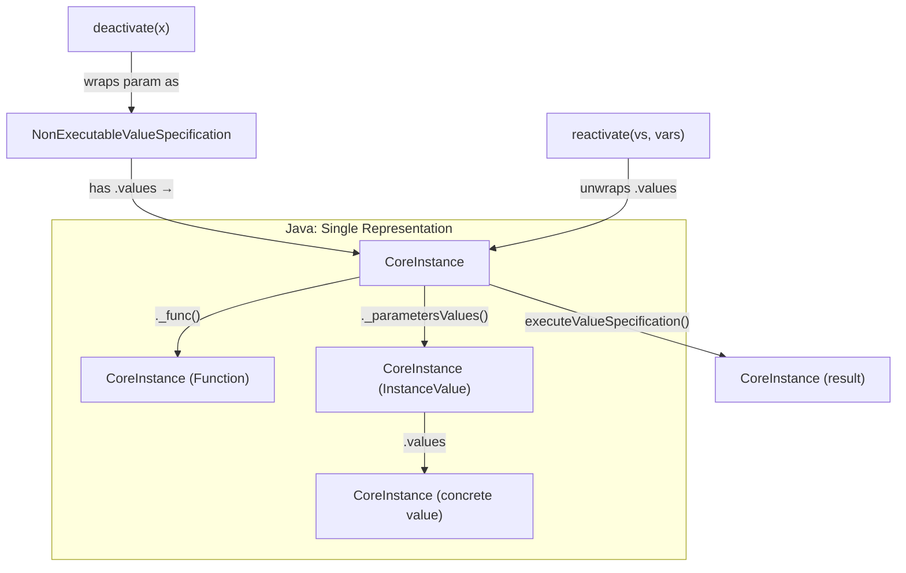
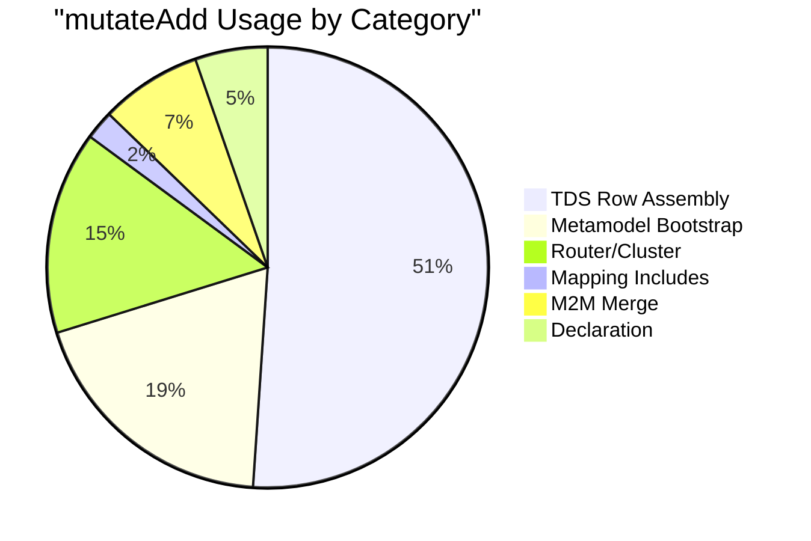

# Can Rust Arena/Index Support Pure Metaprogramming?

## The Question

Pure has metaprogramming primitives — `deactivate`, `reactivate`, `evaluateAndDeactivate`, `openVariableValues` — that decompose expressions into *navigable data structures*. This is not simple eval/quote: Pure programs can walk the expression tree using normal M3 property access (`._func()`, `._parametersValues()`, `.genericType`, etc.).

The question is whether the Rust improvements (Arena/Index, no Generalization, strongly-typed `Expression` enum) are **compatible** with this or whether they **fundamentally break** the "code is data" contract.

---

## How Java Does It: The `CoreInstance` Trick

The key insight is that **Java doesn't have two representations**. Everything — values, types, expressions, the package tree — is a `CoreInstance` in the `ModelRepository`. This makes metaprogramming "free":



### The `deactivate` mechanism (line by line):

```java
// Deactivate.java — the entire execute() method:
public CoreInstance execute(...) {
    return ValueSpecificationBootstrap.wrapValueSpecification(
        params.get(0),   // ← the RAW, UNEVALUATED parameter
        false,           // ← mark as NON-executable
        processorSupport
    );
}
```

Two critical things happening:

1. **`deferParameterExecution()` returns `true`** — so the interpreter does NOT evaluate the argument before calling `deactivate`. It passes the raw `FunctionExpression` / `InstanceValue` / `VariableExpression` node directly.

2. **`wrapValueSpecification(value, false, ...)`** — wraps the raw VS node in a `NonExecutableValueSpecification` with `executable = false`. When the interpreter later encounters this node, `findValueSpecificationExecutor` checks `isExecutable()`, sees `false`, and returns `NonExecutableValueSpecificationExecutor` which simply **returns the node unchanged**. This is the "quoting" mechanism.

### The `reactivate` mechanism:

```java
// Reactivate.java — extracts the VS from args, builds a new VariableContext
// from the provided Map<String, List<Any>>, then calls executeValueSpecification:
return this.functionExecution.executeValueSpecification(
    params.get(0).getValueForMetaPropertyToOne(M3Properties.values),  // ← unwrap the VS
    ...,
    newVarContext,  // ← substitute open variables
    ...
);
```

It **unwraps** the NonExecutableValueSpecification to get the original expression tree, then **re-evaluates** it with new variable bindings. This is the "unquoting" mechanism.

### The navigability contract:

Between `deactivate` and `reactivate`, a Pure program can walk the expression tree using **normal M3 property access**:

```pure
let vs = {|$x + 1}->deactivate();
// vs is now a NonExecutableValueSpecification wrapping a LambdaFunction
// The lambda has:
//   ._expressionSequence() → FunctionExpression (the +)
//     ._func() → points to plus()
//     ._parametersValues() → [VariableExpression($x), InstanceValue(1)]
```

This works because `FunctionExpression`, `InstanceValue`, `VariableExpression` are M3 classes with properties defined in the metamodel. Property access on them goes through the **same** `executeProperty()` path as accessing `.name` on a Person. **This is the core contract.**

---

## The Challenge for Rust

In the Rust architecture, the compiler and runtime use **different representations**:

| Layer | Java | Rust (Current) |
|---|---|---|
| **Compiled expression** | `CoreInstance` (FunctionExpression, InstanceValue, etc.) | `Expression` enum (not yet populated) |
| **Runtime value** | `CoreInstance` (wrapping primitives or class instances) | `Value` enum (not yet defined) |
| **Property access** | `getValueForMetaPropertyToOne(name)` — string-keyed, uniform | `match expr { ... }` — statically dispatched |
| **Meta-level access** | Same as above (they're all `CoreInstance`) | ❌ **No uniform access layer** |

The problem is **not** the Arena/Index pattern. The Arena is fine — it's just a storage mechanism. The problem is that **Rust's strongly-typed `Expression` enum has no property interface**.

In Java, a `FunctionExpression` node can be navigated with `.getValueForMetaPropertyToOne("func")` — the same generic interface used for all M3 instances. In Rust, `Expression::FunctionApplication { function, arguments, .. }` is a struct variant with no `get_property(name)` method.

> [!CAUTION]
> **The Generalization node decision is fine.** `generalizations()` in Java returns `Type` objects via `Type.getGeneralizationResolutionOrder()` — it never exposes `Generalization` instances to user code. The native function can compute this from `super_types` + derived indexes. No metaprogramming concern here.

> [!CAUTION]
> **The Arena/Index pattern is fine.** `deactivate` works on expression trees, not on element storage. The arena stores `Class`, `Function`, etc. — expression trees are separate. ElementIds are actually *better* for reactivation because they're stable handles that survive model evolution.

---

## The Real Gap: ValueSpecification as Navigable M3 Object

The gap is specifically in this flow:

```pure
// Pure code that navigates a deactivated expression:
let expr = {|$x + 1}->deactivate();
let body = $expr->cast(@LambdaFunction<Any>)._expressionSequence()->at(0);
let func = $body->cast(@SimpleFunctionExpression)._func();
// func is now the plus() function
```

This requires the Rust runtime to:
1. Return `Expression` trees as runtime values (not just as compiler data)
2. Support M3 property access (`.func`, `._parametersValues()`, etc.) on those values
3. Support `cast(@SimpleFunctionExpression)` on expression values

### Proposed Solution: `MetaAccessor` Trait

```rust
/// Trait that provides M3-style property navigation on Rust types.
///
/// This is the bridge between Rust's strongly-typed representations
/// and Pure's reflective property access. It is NOT used in the
/// compiler — only in the interpreter when property access targets
/// a meta-level type (ValueSpecification, GenericType, etc.).
pub trait MetaAccessor {
    /// Get a single-valued property by M3 property name.
    fn meta_property_to_one(&self, name: &str) -> Option<Value>;

    /// Get a multi-valued property by M3 property name.
    fn meta_property_to_many(&self, name: &str) -> Vec<Value>;

    /// Get the M3 classifier path (e.g., "meta::pure::metamodel::valuespecification::FunctionExpression")
    fn classifier_path(&self) -> &str;
}
```

Implement it for `Expression`:

```rust
impl MetaAccessor for Expression {
    fn meta_property_to_one(&self, name: &str) -> Option<Value> {
        match (self, name) {
            // FunctionExpression / FunctionApplication
            (Expression::FunctionApplication { function, .. }, "func") => {
                Some(Value::Meta(MetaValue::Function(*function)))
            }
            (Expression::FunctionApplication { arguments, .. }, "parametersValues") => {
                // This is actually a to-many, but sometimes accessed via toOne
                arguments.first().map(|e| Value::Expression(Box::new(e.clone())))
            }
            
            // InstanceValue
            (Expression::Literal { value, .. }, "values") => {
                Some(value.to_runtime_value())
            }
            
            // VariableExpression
            (Expression::Variable { name: var_name, .. }, "name") => {
                Some(Value::String(var_name.clone()))
            }
            
            // Lambda
            (Expression::Lambda { .. }, "expressionSequence") => {
                // Return first expression of the body
                // ...
            }
            
            _ => None,
        }
    }
    
    fn meta_property_to_many(&self, name: &str) -> Vec<Value> {
        match (self, name) {
            (Expression::FunctionApplication { arguments, .. }, "parametersValues") => {
                arguments.iter()
                    .map(|e| Value::Expression(Box::new(e.clone())))
                    .collect()
            }
            (Expression::Lambda { body, .. }, "expressionSequence") => {
                body.iter()
                    .map(|e| Value::Expression(Box::new(e.clone())))
                    .collect()
            }
            _ => vec![],
        }
    }
    
    fn classifier_path(&self) -> &str {
        match self {
            Expression::FunctionApplication { .. } => "meta::pure::metamodel::valuespecification::SimpleFunctionExpression",
            Expression::Literal { .. }             => "meta::pure::metamodel::valuespecification::InstanceValue",
            Expression::Variable { .. }            => "meta::pure::metamodel::valuespecification::VariableExpression",
            Expression::Lambda { .. }              => "meta::pure::metamodel::function::LambdaFunction",
            Expression::PropertyAccess { .. }      => "meta::pure::metamodel::valuespecification::SimpleFunctionExpression",
            _ => "meta::pure::metamodel::valuespecification::ValueSpecification",
        }
    }
}
```

### Runtime Value Extension

```rust
pub enum Value {
    // ... existing variants ...
    
    /// A reified expression tree — the result of `deactivate()`.
    /// This is the Rust equivalent of Java's NonExecutableValueSpecification.
    Expression(Box<Expression>),
    
    /// A meta-level reference (function pointer, type reference, etc.)
    Meta(MetaValue),
}

pub enum MetaValue {
    /// A reference to a function element (resolved)
    Function(ElementId),
    /// A reference to a type element
    Type(ElementId),
    /// A reified GenericType / TypeExpr
    TypeExpr(TypeExpr),
    /// A reified multiplicity
    Multiplicity(Multiplicity),
}
```

---

## Mechanism-by-Mechanism Analysis

### `deactivate(expr)` → ✅ Works with Rust architecture

The mechanism is: **defer parameter evaluation, return the raw `Expression` node wrapped as a `Value`**.

Rust implementation:
```rust
struct DeactivateNative;

impl NativeFunction for DeactivateNative {
    fn defer_parameter_execution(&self) -> bool { true } // ← critical
    
    fn execute(&self, args: &[Value], _ctx: &mut ExecutionContext) -> Result<Value, ExecutionError> {
        // args[0] is the unevaluated Expression itself
        // (because defer_parameter_execution = true, the interpreter
        //  passes the Expression node, not the evaluated result)
        Ok(args[0].clone()) // Already a Value::Expression
    }
}
```

> [!TIP]
> Key design requirement: when `defer_parameter_execution()` returns `true`, the interpreter must pass `Value::Expression(raw_expr)` instead of evaluating it. This is the same duality Java has with executable vs. non-executable value specifications.

### `evaluateAndDeactivate(expr)` → ✅ Works

This evaluates the expression **first**, then wraps the result as a non-executable VS:

```rust
struct EvaluateAndDeactivateNative;

impl NativeFunction for EvaluateAndDeactivateNative {
    fn execute(&self, args: &[Value], _ctx: &mut ExecutionContext) -> Result<Value, ExecutionError> {
        // args[0] is already evaluated (defer = false by default)
        // Return the evaluated value — but type metadata is preserved
        // because the Value enum carries type info intrinsically
        Ok(args[0].clone())
    }
}
```

### `reactivate(vs, varMap)` → ✅ Works with one caveat

```rust
struct ReactivateNative;

impl NativeFunction for ReactivateNative {
    fn execute(&self, args: &[Value], ctx: &mut ExecutionContext) -> Result<Value, ExecutionError> {
        let expr = args[0].as_expression()?;      // unwrap the Expression
        let var_map = args[1].as_map()?;           // Map<String, List<Any>>
        
        // Build a new VariableContext from the map
        let mut var_ctx = VariableContext::new();
        for (name, values) in var_map.iter() {
            var_ctx.register(name, values.clone())?;
        }
        
        // Re-evaluate the expression with the new variable bindings
        ctx.engine.evaluate(expr, &mut var_ctx)
    }
}
```

**Caveat**: The expression tree must be **self-contained** — all `ElementId` references must still be valid in the current model. Since `ElementId`s are stable (chunk_id + local_idx), this works as long as the model hasn't been replaced. This is the same constraint Java has.

### `openVariableValues(fn)` → ✅ Works; requires `LambdaWithContext`

Java's `LambdaWithContext` wraps a lambda with its captured `VariableContext`. Rust needs the same:

```rust
pub enum Value {
    // ...
    Lambda {
        params: Vec<Parameter>,
        body: Vec<Expression>,
        captured_vars: VariableContext,  // ← closed-over variables
        open_vars: Vec<SmolStr>,         // ← list of open variable names
    },
}
```

The `openVariableValues` native iterates `open_vars`, looks up each in `captured_vars`, and returns a `Map<String, List<Any>>`.

### M3 property navigation on expression trees → ⚠️ Requires `MetaAccessor`

This is where the Rust architecture needs the adapter layer. When Pure code does:

```pure
$expr->cast(@SimpleFunctionExpression)._func()
```

The interpreter must:
1. Recognize that `_func` is an M3 metamodel property, not a user-model property
2. Dispatch to `MetaAccessor::meta_property_to_one("func")` on the `Expression`
3. Return the result as a `Value::Meta(MetaValue::Function(element_id))`

This is a **runtime dispatch** that doesn't exist yet in the Rust architecture. But it's a layer you **add on top** of the existing Arena/Expression types — it doesn't require changing them.

---

## The Generalization Question

```java
// Generalizations.java
public CoreInstance execute(...) {
    CoreInstance type = Instance.getValueForMetaPropertyToOneResolved(params.get(0), M3Properties.values, processorSupport);
    ListIterable<CoreInstance> generalizations = Type.getGeneralizationResolutionOrder(type, processorSupport);
    return ValueSpecificationBootstrap.wrapValueSpecification(generalizations, true, processorSupport);
}
```

This returns **Type** objects (Class/PrimitiveType), not `Generalization` wrapper objects. The function computes the C3 linearization order of the type hierarchy and returns the chain.

In Rust:
```rust
fn execute_generalizations(&self, args: &[Value], ctx: &ExecutionContext) -> Result<Value, ExecutionError> {
    let type_id = args[0].as_type()?;
    
    // Walk super_types + derived indexes to compute C3 linearization
    let resolution_order = ctx.model.generalization_order(type_id);
    
    Ok(Value::Collection(
        resolution_order.iter()
            .map(|id| Value::Meta(MetaValue::Type(*id)))
            .collect()
    ))
}
```

**No `Generalization` node needed.** The Rust architecture stores `Class.super_types: Vec<TypeExpr>` and the `DerivedIndexes` compute `specializations_of: HashMap<ElementId, Vec<ElementId>>`. Between these two, the generalization resolution order can be computed without a separate node.

> [!NOTE]
> If some day Pure code accesses `._generalizations` as a raw M3 property (bypassing the native function), the `MetaAccessor` on `Class` could synthesize wrapper values on the fly:
> ```rust
> (Element::Class(cls), "generalizations") => {
>     cls.super_types.iter()
>         .map(|ty| Value::Meta(MetaValue::TypeExpr(ty.clone())))
>         .collect()
> }
> ```
> No stored `Generalization` node is needed because the accessor creates the projections lazily.

---

## Part 2: The `mutateAdd` Analysis

### What Is `mutateAdd`?

```pure
native function meta::pure::functions::lang::mutateAdd<T>(obj:T[1], property:String[1], values:Any[*]):T[1];
```

`mutateAdd` takes an object, a property name (as a string!), and values to append. It uses **Java reflection** to find the setter method for that property and directly mutates the underlying Java object, bypassing Pure's immutability model.

### The Java Implementation

**Interpreted version** ([MutateAdd.java](file:///Users/cocobey73/Projects/legend-engine/legend-engine-core/legend-engine-core-pure/legend-engine-pure-code-functions-unclassified/legend-engine-pure-runtime-java-extension-interpreted-functions-unclassified/src/main/java/org/finos/legend/pure/runtime/java/extension/functions/interpreted/natives/lang/MutateAdd.java)):

```java
public CoreInstance execute(...) {
    CoreInstance obj = params.get(0);
    String propertyName = PrimitiveUtilities.getStringValue(params.get(1));
    ListIterable<? extends CoreInstance> valuesToAdd = params.get(2);
    Instance.addValueToProperty(obj, propertyName, valuesToAdd, processorSupport);
    return obj;
}
```

**Compiled version** ([FunctionsHelper.java](file:///Users/cocobey73/Projects/legend-engine/legend-engine-core/legend-engine-core-pure/legend-engine-pure-code-functions-unclassified/legend-engine-pure-runtime-java-extension-compiled-functions-unclassified/src/main/java/org/finos/legend/pure/runtime/java/extension/functions/compiled/FunctionsHelper.java)):

```java
public static <T> T mutateAdd(T obj, String property, RichIterable<? extends Object> values) {
    String methodName = "_" + property;
    // Uses Java reflection to find the method, then calls it
    Method m = obj.getClass().getMethod(methodName, RichIterable.class);
    RichIterable existing = (RichIterable)obj.getClass().getMethod(methodName).invoke(obj);
    m.invoke(obj, LazyIterate.concatenate(existing, values).toList());
    return obj;
}
```

> [!WARNING]
> **This is unrestricted reflective mutation.** The property name is a runtime string, the values are `Any[*]`, and there's no type checking. It bypasses all of Pure's immutability guarantees.

### Usage Taxonomy: 94 Call Sites, 31 Unique Source Files

We identified all `mutateAdd` usages across `legend-engine` (excluding `target/` duplicates). They fall into **5 distinct categories**:

---

#### Category 1: TDS Row Assembly (48 call sites — **51% of all usage**)

**Pattern**: `$newTds->mutateAdd('rows', $transformedRows)`

**Where**: [tds.pure](file:///Users/cocobey73/Projects/legend-engine/legend-engine-core/legend-engine-core-pure/legend-engine-pure-code-compiled-core/src/main/resources/core/pure/tds/tds.pure) (15 sites), [relational TDS](file:///Users/cocobey73/Projects/legend-engine/legend-engine-xts-relationalStore/legend-engine-xt-relationalStore-generation/legend-engine-xt-relationalStore-pure/legend-engine-xt-relationalStore-core-pure/src/main/resources/core_relational/relational/tds/tds.pure), relational execution protocols (v1_20 through vX_X_X — 14 near-identical versions)

**Why it exists**: `TabularDataSet` has `rows: TDSRow[*]` and each `TDSRow` has `parent: TabularDataSet[0..1]`. This creates a **circular reference** — the TDS needs to exist before its rows can be created (because rows need a `parent` pointer back to the TDS), but the TDS can't be constructed with rows until the rows exist.

```pure
// The classic pattern — every TDS operation follows this:
let newTds = ^TabularDataSet(columns = $tds.columns);  // 1. Create empty TDS
let newRows = $tds.rows->map(r|^TDSRow(parent=$newTds, values=$r.values)); // 2. Create rows pointing to it
$newTds->mutateAdd('rows', $newRows);  // 3. Mutate to add rows
$newTds;  // 4. Return the now-complete TDS
```

Note the `//todo: remove this by making parent an association` comment in the actual source code — the authors themselves recognize this is a workaround.

> [!TIP]
> **Rust Strategy**: **Builder Pattern + Two-Phase Construction**. This is the most straightforward category to handle:
> ```rust
> // Phase 1: Create TDS handle
> let tds_id = arena.alloc_tds(columns);
> // Phase 2: Create rows with parent reference
> let rows = old_rows.iter()
>     .map(|r| TDSRow { parent: Some(tds_id), values: r.values.clone() })
>     .collect();
> // Phase 3: Complete the TDS (arena update, not mutation)
> arena.set_rows(tds_id, rows);
> ```
> In an Arena model, this is trivial — you allocate the shell, get its ID, create children pointing to it, then fill in the rows field. No mutation needed.

---

#### Category 2: Metamodel Bootstrap / Code Generation (18 call sites — **19%**)

**Pattern**: `$cls->mutateAdd('properties', $props)->mutateAdd('constraints', $constraints)` and `$cls->mutateAdd('generalizations', $gen)`

**Where**: 
- [xsdToPure.pure](file:///Users/cocobey73/Projects/legend-engine/legend-engine-xts-xml/legend-engine-xt-xml-pure/src/main/resources/core_external_format_xml/transformation/toPure/xsdToPure.pure) (XSD → Pure model generation)
- [toPure_sdl.pure](file:///Users/cocobey73/Projects/legend-engine/legend-engine-xts-graphQL/legend-engine-xt-graphQL-pure/src/main/resources/core_external_query_graphql/binding/toPure/sdl/toPure_sdl.pure) (GraphQL SDL → Pure classes)
- [toPure_introspection.pure](file:///Users/cocobey73/Projects/legend-engine/legend-engine-xts-graphQL/legend-engine-xt-graphQL-pure/src/main/resources/core_external_query_graphql/binding/toPure/introspection/toPure_introspection.pure)
- [conventions.pure](file:///Users/cocobey73/Projects/legend-engine/legend-engine-xts-java/legend-engine-xt-javaGeneration-pure/src/main/resources/core_external_language_java/generation/conventions.pure) (Java code generation conventions)
- [graphToProtocol.pure](file:///Users/cocobey73/Projects/legend-engine/legend-engine-xts-protocol-java-generation/legend-engine-protocol-generation-pure/src/main/resources/core_protocol_generation/pureGeneration/graphToProtocol.pure)

**Why it exists**: These are **code generators** that programmatically build Pure metamodel elements (Class, Property, Generalization, Constraint) from external schemas. The pattern is always:

```pure
let c = newClass($name);                          // 1. Create naked class
let cls = ^$c(generalizations = []);              // 2. Strip default generalization
$super->mutateAdd('specializations', $gen);       // 3. Link super → sub
$cls->mutateAdd('generalizations', $gen);         // 4. Link sub → super (bidirectional!)
$cls->mutateAdd('properties', $annotatedProps);   // 5. Add properties
$cls->mutateAdd('constraints', $constraints);     // 6. Add constraints
```

The key issue here is **bidirectional cross-references**: a `Generalization` links both `general` (superclass) and `specific` (subclass), and both ends need to know about it.

> [!TIP]
> **Rust Strategy**: **Arena Two-Phase Construction**. The Arena model handles this natively:
> ```rust
> let class_id = arena.alloc_class(name, package);  // 1. Allocate shell
> let super_id = lookup_class(super_name);           // 2. Resolve super
> arena.add_super_type(class_id, super_id);          // 3. Link (arena knows both ends)
> arena.set_properties(class_id, props);             // 4. Fill in properties
> ```
> The Arena owns all the data, so "bidirectional" is just updating two index entries. No mutation of the objects themselves.

---

#### Category 3: Router / Cluster PropertyMapping Assembly (14 call sites — **15%**)

**Pattern**: `$newSet->mutateAdd('propertyMappings', $newPropMappingsWithOwner)`

**Where**: 
- [routing.pure](file:///Users/cocobey73/Projects/legend-engine/legend-engine-core/legend-engine-core-pure/legend-engine-pure-code-compiled-core/src/main/resources/core/pure/router/store/routing.pure) (mapping include assembly)
- [cluster.pure](file:///Users/cocobey73/Projects/legend-engine/legend-engine-core/legend-engine-core-pure/legend-engine-pure-code-compiled-core/src/main/resources/core/pure/router/store/cluster.pure) (cross-store clustering)

**Why it exists**: Same circular reference problem as TDS — a `PropertyMapping` has `owner: SetImplementation[1]`, and the `SetImplementation` has `propertyMappings: PropertyMapping[*]`. You can't construct both at once:

```pure
let newSet = ^$set(id=$newSetId, propertyMappings=[]);        // 1. Create set without mappings
let newPMs = $pms->map(pm | ^$pm(owner=$newSet));             // 2. Create mappings pointing to set
$newSet->mutateAdd('propertyMappings', $newPMs);              // 3. Mutate to link
```

> [!TIP]
> **Rust Strategy**: Same Arena two-phase pattern as Category 2. Alternatively, wrap in a `Builder`:
> ```rust
> let set = SetImplementationBuilder::new(class_id, set_id)
>     .add_property_mapping(pm1)
>     .add_property_mapping(pm2)
>     .build(&mut arena);  // ← resolves owner references internally
> ```

---

#### Category 4: Mapping Include Assembly (2 call sites — **2%**)

**Pattern**: `$newMapping->mutateAdd('includes', $includedMappings)`

**Where**: [routing.pure](file:///Users/cocobey73/Projects/legend-engine/legend-engine-core/legend-engine-core-pure/legend-engine-pure-code-compiled-core/src/main/resources/core/pure/router/store/routing.pure) line 98

**Why it exists**: `MappingInclude` has `owner: Mapping[1]`, creating the same circular reference.

> [!TIP]
> **Rust Strategy**: Same Arena two-phase pattern.

---

#### Category 5: Model-to-Model Merge (7 call sites — **7%**)

**Pattern**: `$set->at(0)->mutateAdd($p.name->toOne(), $propertyValuesFromOtherInstances->toOne()->getPropertyValues($p.name->toOne()))`

**Where**: [inMemory.pure](file:///Users/cocobey73/Projects/legend-engine/legend-engine-core/legend-engine-core-pure/legend-engine-pure-code-compiled-core/src/main/resources/core/store/m2m/inMemory.pure) line 407, ServiceStore tests, RelationalAI mapping

**Why it exists**: The M2M merge operation takes multiple instances from different set implementations and **combines** them into a single object. It iterates all properties, finds which instance has a value for each property, and mutates the first instance to absorb values from the others.

This is the **hardest category** — it's genuinely imperative object assembly at runtime, not just constructor workarounds.

> [!WARNING]
> **This is the only category that requires true runtime mutation.** Unlike Categories 1-4, which are all about construction-time circular references, Category 5 mutates an already-"complete" object to merge values from other objects.

> [!TIP]
> **Rust Strategy**: **MutableCell wrapper** (last resort):
> ```rust
> pub enum Value {
>     // ...
>     /// A mutable object, used only during merge operations.
>     /// Properties are stored in a HashMap that can be modified.
>     MutableObject {
>         classifier: ElementId,
>         properties: RefCell<HashMap<SmolStr, Vec<Value>>>,
>     },
> }
> ```
> The `mergeResult` function creates a `MutableObject`, fills it via property iteration, then freezes it into a regular `Object` value. Mutation is confined to a single function scope.
>
> Alternatively, **functional merge**: build a `KeyValue` list from all sources, then call `dynamicNew` once:
> ```rust
> let merged_kvs: Vec<KeyValue> = all_properties.iter()
>     .filter_map(|p| {
>         instances.iter()
>             .find(|inst| inst.has_value(p.name))
>             .map(|inst| KeyValue { key: p.name, value: inst.get(p.name) })
>     })
>     .collect();
> dynamic_new(target_class, merged_kvs)  // ← no mutation!
> ```

---

### Other Notable Usage Patterns

| File | Pattern | Category |
|---|---|---|
| [relationalExtension.pure](file:///Users/cocobey73/Projects/legend-engine/legend-engine-xts-relationalStore/legend-engine-xt-relationalStore-generation/legend-engine-xt-relationalStore-pure/legend-engine-xt-relationalStore-core-pure/src/main/resources/core_relational/relational/relationalExtension.pure) | Store/Schema/Table assembly | Cat 2 |
| [databaseHelperFunctions.pure](file:///Users/cocobey73/Projects/legend-engine/legend-engine-xts-relationalStore/legend-engine-xt-relationalStore-generation/legend-engine-xt-relationalStore-pure/legend-engine-xt-relationalStore-core-pure/src/main/resources/core_relational/relational/helperFunctions/databaseHelperFunctions.pure) | Database element construction | Cat 2 |
| [generationHelper.pure](file:///Users/cocobey73/Projects/legend-engine/legend-engine-xts-sql/legend-engine-xt-sql-transformation/legend-engine-xt-sql-reversePCT/src/main/resources/core_external_query_sql_reverse_pct/generationHelper.pure) | SQL reverse PCT | Cat 2 |
| [relationalMappingExecution.pure](file:///Users/cocobey73/Projects/legend-engine/legend-engine-xts-relationalStore/legend-engine-xt-relationalStore-generation/legend-engine-xt-relationalStore-pure/legend-engine-xt-relationalStore-core-pure/src/main/resources/core_relational/relational/relationalMappingExecution.pure) | TDS result assembly | Cat 1 |
| [pct_relational.pure](file:///Users/cocobey73/Projects/legend-engine/legend-engine-xts-relationalStore/legend-engine-xt-relationalStore-PCT/legend-engine-pure-functions-relationalStore-PCT-pure/src/main/resources/core_external_test_connection/pct_relational.pure) | Test connection setup | Cat 2 |
| [store.pure (relationalai)](file:///Users/cocobey73/Projects/legend-engine/legend-engine-xts-relationalai/legend-engine-xt-relationalai-pure/src/main/resources/core_external_query_relationalai/rel/metamodel/store.pure) | RAI store metamodel | Cat 2/5 |
| [store.pure (serviceStore)](file:///Users/cocobey73/Projects/legend-engine/legend-engine-xts-serviceStore/legend-engine-xt-serviceStore-pure/src/main/resources/core_servicestore/tests/store.pure) | Test fixture | Cat 2 |

---

### Verdict: Is `mutateAdd` a Deal-Breaker?

> [!IMPORTANT]
> **No. `mutateAdd` is NOT a deal-breaker for the Rust architecture.**

The analysis reveals that:

1. **87% of usages (Categories 1-4)** are workarounds for circular references during construction. These are handled natively by the Arena/Index pattern — you allocate a handle, create children pointing to it, then fill in the collection field. **No mutation of live objects is needed.**

2. **7% of usages (Category 5)** are genuine runtime merges. These can be rewritten as functional construction (`dynamicNew` with merged `KeyValue` lists) or, as a last resort, confined to a `MutableObject` wrapper whose mutation is scoped to a single function.

3. **6% of usages** are duplicates in `target/` directories — build artifacts.



### The Recommended Approach

| Category | % | Rust Strategy | Mutation Needed? |
|---|---|---|---|
| TDS Row Assembly | 51% | Arena two-phase / builder | ❌ No |
| Metamodel Bootstrap | 19% | Arena two-phase / builder | ❌ No |
| Router/Cluster | 15% | Arena two-phase / builder | ❌ No |
| Mapping Includes | 2% | Arena two-phase | ❌ No |
| M2M Merge | 7% | Functional merge or MutableCell | ⚠️ Confined |

> [!NOTE]
> **Long-term**: Even in Java, `mutateAdd` should be deprecated. The `//todo` comments in the TDS code prove the authors want to eliminate it. The Rust interpreter can implement `mutateAdd` as a native function for compatibility, but the idiomatic Rust code paths should use builders and arena construction. This gives us a migration path: implement `mutateAdd` first for parity, then gradually refactor Pure code to use immutable alternatives.

---

## Overall Architecture Assessment

| Feature | Arena/Index | No Generalization | Strongly-Typed Expression | Overall |
|---|---|---|---|---|
| `deactivate` | ✅ No impact | ✅ No impact | ✅ Expression IS the data | ✅ |
| `reactivate` | ✅ Stable ElementIds | ✅ No impact | ✅ Can re-evaluate | ✅ |
| `evaluateAndDeactivate` | ✅ | ✅ | ✅ | ✅ |
| `openVariableValues` | ✅ | ✅ | ✅ (Lambda carries context) | ✅ |
| `canReactivateDynamically` | ✅ | ✅ | ✅ (always true) | ✅ |
| M3 property walk on VS | ✅ | ✅ | ⚠️ Needs `MetaAccessor` | ⚠️ |
| `generalizations()` | ✅ | ✅ Computed from `super_types` | ✅ | ✅ |
| `instanceOf(@FunctionExpression)` | ✅ | ✅ | ✅ via `classifier_path()` | ✅ |
| `cast(@SimpleFunctionExpression)` | ✅ | ✅ | ✅ via `classifier_path()` match | ✅ |
| **`mutateAdd`** | ✅ Natural fit | ✅ No impact | ✅ No impact | ✅ |

### Bottom line

> [!IMPORTANT]
> **The Rust architectural improvements are compatible with Pure's metaprogramming, including `mutateAdd`.** The Arena/Index pattern actually *solves* 87% of `mutateAdd` use cases more cleanly than Java does — circular references are handled by the arena's handle-based construction, eliminating the need for post-hoc mutation.
>
> **The one gap is M3 property navigation on expression nodes** (`._func()`, `._parametersValues()`). This requires a `MetaAccessor` trait — an adapter layer that projects strongly-typed Rust fields as string-keyed properties. This is additive, not destructive: you keep compile-time safety in the compiler pipeline, and add runtime reflection only in the interpreter.

### What this means in practice

The Rust architecture gives you a **two-speed** model:

1. **Compiler path** (fast, type-safe): `match expr { Expression::FunctionApplication { function, .. } => ... }` — static dispatch, exhaustive, zero overhead.

2. **Meta path** (reflective, interpreter-only): `expr.meta_property_to_one("func")` — dynamic dispatch via trait, used only when Pure code navigates expression trees at runtime.

Java has only one speed (everything is `CoreInstance`). The Rust design is strictly better: you get the fast path for free, and pay for reflection only when Pure code actually uses it.

---

## Risk: What Could Force a Design Change?

The one scenario that would force abandoning strongly-typed expressions is if Pure gains **expression mutation at runtime** — i.e., the ability to modify a deactivated expression tree before reactivating it. Java's `CoreInstance` supports this because `addValueToProperty` / `setKeyValues` work on any node.

Currently, Pure's metaprogramming is **read-only introspection + re-evaluation with new bindings**. If that contract holds, Rust's immutable `Expression` enum is sufficient. If Pure ever adds AST-rewriting primitives, we'd need a separate mutable representation for the meta layer — but that would also be a breaking change to the Java contract.

> [!TIP]
> **Recommendation**: Document this as an architectural invariant in `DESIGN.md`:
> *"Expression trees are immutable. Metaprogramming (deactivate/reactivate) supports read-only introspection and re-evaluation with variable substitution. Expression mutation is not supported and would require architectural review."*
