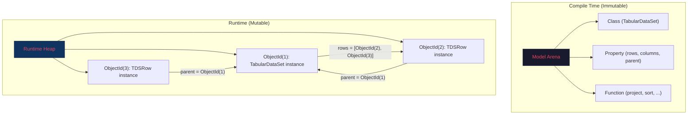

# How `mutateAdd` Works in the Rust Interpreter — The Full Mechanics

## The Sharp Question

> "For the 87%, how will the Pure code support this? Will the `mutateAdd` just update the arena/index?"

Short answer: **The Pure code does NOT change. `mutateAdd` does NOT touch the model arena. It mutates runtime objects in a separate `RuntimeHeap`.**

Let me be precise about what I got wrong in the previous analysis, and what actually needs to happen.

---

## Correcting the Previous Claim

The previous analysis said "87% of mutateAdd usage is solved by the Arena pattern." That was **imprecise and somewhat misleading**. Here's the correction:

> [!WARNING]
> The model arena (where `Class`, `Function`, `Package` live) and runtime objects (where `TabularDataSet`, `TDSRow`, `PropertyMapping` instances live) are **completely different things**.
>
> - The **model arena** is populated at compile time, is immutable, and uses `ElementId` handles. `mutateAdd` never touches it.
> - **Runtime objects** are created during execution by the `^` (new) operator. These live in a **runtime heap**, not the model arena.

The Arena pattern helps with the *model element* construction during bootstrap/codegen (Category 2: building `Class`, `Property`, `Generalization` at compile time). But for Categories 1, 3, 4 — TDS, Router, Mapping — those are **runtime objects**, and the question is precisely: "what data structure holds them, and how does `mutateAdd` modify them?"

---

## Two Storage Layers in the Rust Interpreter



### Layer 1: Model Arena (Compile-Time)

This is the existing `ChunkedArena<Element>` that stores the metamodel:

```rust
// Already exists in the Rust parser
pub struct Model {
    elements: ChunkedArena<Element>,  // Class, Function, Package, etc.
    derived: DerivedIndexes,          // path → ElementId, etc.
}
```

**`mutateAdd` never touches this.** When Pure code does `$cls->mutateAdd('properties', $props)` in the XSD codegen, it's not modifying the *definition* of `TabularDataSet` in the model arena. It's modifying a *runtime instance* of a class.

### Layer 2: Runtime Heap (Execution-Time)

This is what we need to build. It stores instances created by `^Class(...)`:

```rust
use slotmap::SlotMap;

slotmap::new_key_type! { pub struct ObjectId; }

/// A runtime instance of a Pure class
pub struct RuntimeObject {
    /// Which class this is an instance of (points into the Model Arena)
    classifier: ElementId,
    /// Property values, keyed by property name
    /// This is the thing mutateAdd modifies
    properties: HashMap<SmolStr, Vec<Value>>,
}

/// The runtime heap — stores all objects created during execution
pub struct RuntimeHeap {
    objects: SlotMap<ObjectId, RuntimeObject>,
}
```

---

## What Happens When Java Executes `mutateAdd`

Let's trace through the exact Java mechanics first, because the Rust version mirrors this:

```java
// In Instance.java:
public static void addValueToProperty(CoreInstance owner, String keyName,
                                       Iterable<? extends CoreInstance> values,
                                       ProcessorSupport processorSupport) {
    // 1. Find the Property definition for "rows" on TabularDataSet
    ListIterable<String> path = processorSupport.property_getPath(
        findProperty(owner, keyName, processorSupport)
    );
    // 2. MUTATE the CoreInstance's internal property map
    processorSupport.instance_addValueToProperty(owner, path, values);
}
```

And `CoreInstance` itself has mutable methods:
```java
// CoreInstance.java, line 189-191:
void setKeyValues(ListIterable<String> key, ListIterable<? extends CoreInstance> value);
void addKeyValue(ListIterable<String> key, CoreInstance value);
```

**Every `CoreInstance` in Java is inherently mutable** — it's a map of property-name → list-of-values, and `mutateAdd` just calls `addKeyValue`. The object stays at the same memory address. All existing references to it see the change. This is **identity-preserving in-place mutation**.

---

## What Must Happen in Rust

The Rust interpreter must provide the same semantics: **`mutateAdd` modifies the object in-place, and all existing references to that object see the change instantly.**

This means `Value::Object` **cannot be a copy-on-write struct**. It must be a handle/pointer to shared mutable state.

### The Correct Rust Architecture

```rust
/// Runtime values in the interpreter
pub enum Value {
    // Primitives (immutable, copy)
    Boolean(bool),
    Integer(i64),
    Float(f64),
    String(SmolStr),
    Date(PureDate),
    
    // Collections
    Collection(Vec<Value>),
    
    // Object reference — points into the RuntimeHeap
    // This is the key insight: objects are handles, not inline data
    Object(ObjectId),
    
    // ... Expression, Lambda, Meta variants for metaprogramming ...
}

impl RuntimeHeap {
    /// Create a new object (the `^Class(...)` operator)
    pub fn new_object(&mut self, classifier: ElementId, 
                      initial_props: HashMap<SmolStr, Vec<Value>>) -> ObjectId {
        self.objects.insert(RuntimeObject {
            classifier,
            properties: initial_props,
        })
    }
    
    /// Get a property value (the `.property` accessor)
    pub fn get_property(&self, obj: ObjectId, name: &str) -> &[Value] {
        self.objects[obj].properties
            .get(name)
            .map(|v| v.as_slice())
            .unwrap_or(&[])
    }
    
    /// THE mutateAdd implementation  
    pub fn mutate_add(&mut self, obj: ObjectId, property: &str, values: Vec<Value>) {
        self.objects[obj].properties
            .entry(SmolStr::from(property))
            .or_insert_with(Vec::new)
            .extend(values);
    }
}
```

### The `mutateAdd` Native Function

```rust
struct MutateAddNative;

impl NativeFunction for MutateAddNative {
    fn execute(
        &self,
        args: &[Value],
        ctx: &mut ExecutionContext,
    ) -> Result<Value, ExecutionError> {
        // args[0] = the object to mutate
        // args[1] = property name (String)
        // args[2] = values to add
        
        let obj_id = args[0].as_object()?;       // ObjectId
        let prop_name = args[1].as_string()?;     // "rows"
        let values = args[2].as_collection()?;    // Vec<Value>
        
        // Mutate the object IN PLACE in the heap
        ctx.heap.mutate_add(obj_id, &prop_name, values);
        
        // Return the SAME object reference (identity-preserving)
        Ok(args[0].clone())  // Same ObjectId
    }
}
```

---

## Traced Execution: The TDS `project()` Function

Let's trace through exactly what happens when the Rust interpreter runs this Pure code from [tds.pure:318-344](file:///Users/cocobey73/Projects/legend-engine/legend-engine-core/legend-engine-core-pure/legend-engine-pure-code-compiled-core/src/main/resources/core/pure/tds/tds.pure#L318-L344):

```pure
function project<T>(set:T[*], columnSpecifications:ColumnSpecification<T>[*]):TabularDataSet[1]
{
   let simpleCols = ...;
   let functions = $simpleCols.func;
   
   // Step 1: Create a TDS with columns but no rows
   let res = ^TabularDataSet(columns = $simpleCols->map(cs| ... ^TDSColumn(...) ...));
   
   // Step 2: Create rows that reference $res as parent
   let newRows = $set->map(value| ... ^TDSRow(values=[], parent=$res) ... );
   
   // Step 3: MUTATE — add rows to the TDS  
   $res->mutateAdd('rows', $newRows);
   
   // Step 4: Return $res
   $res;
}
```

### Step-by-step in the Rust interpreter:

```
Step 1: ^TabularDataSet(columns = ...)
─────────────────────────────────────────
  - Interpreter resolves TabularDataSet → ElementId(42) in model arena
  - Heap.new_object(ElementId(42), {columns: [col1, col2, col3]})
  - Returns ObjectId(7)
  - Variable '$res' binds to Value::Object(ObjectId(7))
  
  RuntimeHeap state:
  ┌─────────────────────────────────────────────┐
  │ ObjectId(7): TabularDataSet                  │
  │   columns: [Value::Object(col1), ...]        │
  │   rows:    [] (empty!)                       │
  └─────────────────────────────────────────────┘

Step 2: ^TDSRow(values=[], parent=$res)
─────────────────────────────────────────────
  - 'parent=$res' evaluates to Value::Object(ObjectId(7))
  - Heap.new_object(TDSRow_class, {values: [], parent: ObjectId(7)})
  - Returns ObjectId(8), ObjectId(9), ObjectId(10), ...
  
  RuntimeHeap state:
  ┌──────────────────────────────────────────┐
  │ ObjectId(7): TabularDataSet              │
  │   columns: [...]                         │
  │   rows:    [] (still empty!)             │
  ├──────────────────────────────────────────┤
  │ ObjectId(8): TDSRow                      │
  │   values: [...]                          │
  │   parent: ObjectId(7)  ←── points back!  │
  ├──────────────────────────────────────────┤
  │ ObjectId(9): TDSRow                      │
  │   values: [...]                          │
  │   parent: ObjectId(7)  ←── points back!  │
  └──────────────────────────────────────────┘

Step 3: $res->mutateAdd('rows', $newRows)
─────────────────────────────────────────────
  - MutateAddNative.execute([ObjectId(7), "rows", [ObjectId(8), ObjectId(9)]])
  - Heap.mutate_add(ObjectId(7), "rows", [ObjectId(8), ObjectId(9)])
  - This modifies ObjectId(7) IN PLACE
  - Returns ObjectId(7) (same reference)
  
  RuntimeHeap state:
  ┌──────────────────────────────────────────────────────────┐
  │ ObjectId(7): TabularDataSet                              │
  │   columns: [...]                                         │
  │   rows:    [ObjectId(8), ObjectId(9)]  ←── NOW FILLED!   │
  ├──────────────────────────────────────────────────────────┤
  │ ObjectId(8): TDSRow                                      │
  │   values: [...]                                          │
  │   parent: ObjectId(7)                                    │
  ├──────────────────────────────────────────────────────────┤
  │ ObjectId(9): TDSRow                                      │
  │   values: [...]                                          │
  │   parent: ObjectId(7)                                    │
  └──────────────────────────────────────────────────────────┘

Step 4: $res → Value::Object(ObjectId(7))
  - The returned TDS now has both rows AND the circular parent links
  - Any code that holds ObjectId(7) sees the updated rows
```

---

## Why This Must Be Mutable (Not Copy-on-Write)

You might ask: "Why not just create a new object with the rows filled in?" 

The answer is **identity**. Look at the Pure code again:

```pure
let res = ^TabularDataSet(columns = ...);
let newRows = $set->map(value| ^TDSRow(parent=$res, ...)); // rows point to $res
$res->mutateAdd('rows', $newRows);                          // $res gets the rows
$res;                                                       // return $res
```

The rows were already created with `parent=$res` **before** `mutateAdd` is called. If `mutateAdd` created a *new* TDS object instead of modifying the existing one, the rows would still point to the *old* object (the one without rows). The circular reference would be broken.

```
If mutateAdd copies (WRONG):                    If mutateAdd mutates in-place (CORRECT):
                                                
   ┌─ ObjectId(7): TDS (no rows) ←─── parent   ┌─ ObjectId(7): TDS (HAS rows) ←── parent
   │   rows: []                        │        │   rows: [ObjectId(8)]             │
   │                                   │        │                                   │
   │  ObjectId(99): TDS (has rows)     │        │  ObjectId(8): TDSRow              │
   │   rows: [ObjectId(8)]             │        │   parent: ObjectId(7) ─────────────┘
   │                                   │        │
   │  ObjectId(8): TDSRow              │        └─ Circular reference is CORRECT
   │   parent: ObjectId(7) ────────────┘        
   │
   └─ Reference is STALE — row points to  
      old TDS without rows!
```

This is why Java's `CoreInstance` is mutable. And this is why the Rust `RuntimeHeap` must support in-place mutation through `ObjectId` handles.

---

## The Revised Architecture Summary

| Storage | What Lives There | When Populated | Mutable? |
|---|---|---|---|
| **Model Arena** | `Class`, `Function`, `Package`, `Property` definitions | Compile time | ❌ Immutable after compile |
| **Runtime Heap** | Instances created by `^`, e.g., `TabularDataSet`, `TDSRow`, `SetImplementation` copies | Execution time | ✅ Yes, via `mutateAdd` |

The **Runtime Heap** is a `SlotMap<ObjectId, RuntimeObject>` where each `RuntimeObject` has a mutable `HashMap<SmolStr, Vec<Value>>` for its property values. `mutateAdd` is a simple `HashMap::entry().or_default().extend()` operation.

### What about the "Arena pattern solves 87%"?

That claim was about the **structural pattern** — in an arena/handle world, you can allocate a shell, get its handle, create children pointing to the handle, then fill in the parent's collection. The *topology* is the same as Java's mutable `CoreInstance`. The difference is:

- **Java**: Every object IS a mutable node. `mutateAdd` is the universal mechanism.
- **Rust**: Objects are handles into a mutable heap. `mutateAdd` calls `heap.mutate_add()`. The *semantics are identical*, but the ownership model is explicit.

The Pure code doesn't change at all. The `mutateAdd` native function simply delegates to `RuntimeHeap::mutate_add()`.

> [!IMPORTANT]
> **To be crystal clear**: The Pure source code (`.pure` files) is completely untouched. `mutateAdd` remains a native function. The Rust interpreter implements it as a `RuntimeHeap` mutation. The 87% / 7% distinction from the previous analysis was about *whether the usage could theoretically be eliminated from the Pure code itself*, not about what the Rust interpreter needs to do. The Rust interpreter must support `mutateAdd` for 100% of cases, and it does so through the `RuntimeHeap`.
