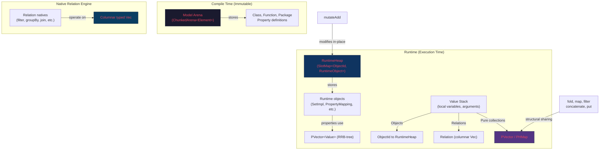

# Persistent Data Structures in the Rust Pure Interpreter

## Critical Context: TDS vs Relation

> [!IMPORTANT]
> **TDS (`TabularDataSet`) is deprecated.** The successor is **Relation**, whose operations (`filter`, `groupBy`, `join`, `extend`, `reduce`, etc.) are all **native functions** — implemented directly in Java/Rust, not in Pure code.
>
> This means the TDS `mutateAdd` + `fold` patterns analyzed earlier are **legacy code**. The Relation path uses a columnar `TestTDS` data structure internally, with zero `mutateAdd` calls. In Rust, we implement Relation natives with whatever optimal data layout we choose.

### Confirmed: Zero `mutateAdd` in Relation

```
$ grep -r mutateAdd legend-engine-pure-code-functions-relation/
(no results)
```

### What Relation Natives Look Like

From [RelationNativeImplementation.java](file:///Users/cocobey73/Projects/legend-engine/legend-engine-core/legend-engine-core-pure/legend-engine-pure-code-functions-relation/legend-engine-pure-runtime-java-extension-compiled-functions-relation/src/main/java/org/finos/legend/pure/runtime/java/extension/external/relation/compiled/RelationNativeImplementation.java):

```java
// filter — native, no Pure interpretation needed
public static <T> Relation<? extends T> filter(Relation<? extends T> rel, 
                                                Function2 pureFunction, ExecutionSupport es) {
    TestTDSCompiled tds = getTDS(rel, es);
    MutableIntSet list = new IntHashSet();
    for (int i = 0; i < tds.getRowCount(); i++) {
        if (!(boolean) pureFunction.value(new RowContainer(tds, i), es))
            list.add(i);
    }
    return new TDSContainer((TestTDSCompiled) tds.drop(list), ps);
}

// groupBy — native, columnar operations, no fold+Map.put in Pure
private static <T> Relation<?> groupBy(Relation<? extends T> rel, MutableList<String> cols,
                                        MutableList<AggColSpecTrans1> aggs, ExecutionSupport es) {
    TestTDSCompiled tds = getTDS(rel, es);
    Pair<TestTDS, MutableList<Pair<Integer, Integer>>> sortRes = tds.sort(...);
    TestTDS distinctTDS = sortRes.getOne()._distinct(sortRes.getTwo()).removeColumns(...);
    return new TDSContainer(aggregateTDS(...).injectInto(distinctTDS, TestTDS::addColumn), ps);
}
```

The backing storage is **columnar** — `TestTDS` stores `Map<String, Object[]>` where each column is a typed array (`Long[]`, `Double[]`, `String[]`, etc.). This is fundamentally different from the row-based, object-per-row TDS model.

---

## Three Optimization Domains

Since Relation is native, we have **three distinct optimization targets**, each with different data structure needs:

```mermaid
graph TD
    subgraph "Domain 1: General Interpreter"
        GI["User Pure code"]
        GI --> |"fold, map, filter on"| PDS["Pure Collections<br/>(Map, List)"]
        PDS --> |"use"| HAMT["HAMT + RRB-tree<br/>(im-rc)"]
    end
    
    subgraph "Domain 2: Relation Engine (Native)"
        RE["Relation natives"]
        RE --> |"operate on"| COL["Columnar storage<br/>(typed arrays)"]
        COL --> |"use"| ARR["Vec of i64, Vec of f64,<br/>Vec of Option SmolStr"]
    end
    
    subgraph "Domain 3: Router/Metamodel"
        RM["Router, XSD, GraphQL"]
        RM --> |"build via"| MA["mutateAdd + fold"]
        MA --> |"use"| HEAP["RuntimeHeap<br/>(SlotMap + HAMT props)"]
    end
    
    style HAMT fill:#533483,stroke:#16213e,color:#e94560
    style ARR fill:#0f3460,stroke:#16213e,color:#e94560
    style HEAP fill:#1a1a2e,stroke:#16213e,color:#e94560
```



---

## Domain 1: General Interpreter — Where HAMT/RRB Helps

Pure is a **functional language**. User Pure code uses `fold`, `map`, `filter`, `concatenate`, `Map.put` extensively. These are the operations where persistent data structures shine — NOT for Relation (which is native), but for **everything else**: user-defined Pure functions, router logic, metamodel construction, and general collection manipulation.

### Where It Helps: `fold` + `Map.put` Accumulator Pattern

This pattern appears in router code, metamodel construction, and user Pure functions:

```pure
// Common Pure pattern: build a Map from a collection
let result = $items->fold(
    {item, acc | $acc->put($item.key, $item.value)},
    ^Map<String, Any>()
);
```

With `std::HashMap`, every `put` clones the entire map — O(N²) total for N items.
With HAMT: O(N × log₃₂ N) — each `put` shares structure with the previous version.

### Where It Helps: `concatenate` in `fold`

```pure
// Building up a list in a fold
let allResults = $sources->fold(
    {source, acc | $acc->concatenate($source->process())},
    []
);
```

With `Vec`, each concatenation copies the entire accumulated list — O(N²).
With RRB-tree `Vector`: O(N log N) via structural sharing.

### Where It Does NOT Help: `mutateAdd`

`mutateAdd` needs **in-place identity-preserving mutation** — the same `ObjectId` must be visible to all holders of a reference. Persistent data structures create *new versions*, which breaks the identity contract. `mutateAdd` still uses the `RuntimeHeap` with `SlotMap<ObjectId, RuntimeObject>`.

---

## Domain 2: Relation Engine — Columnar Native Implementation

The Java `TestTDS` ([source](file:///Users/cocobey73/Projects/legend-engine/legend-engine-core/legend-engine-core-pure/legend-engine-pure-code-functions-relation/legend-engine-pure-runtime-java-extension-shared-functions-relation/src/main/java/org/finos/legend/pure/runtime/java/extension/external/relation/shared/TestTDS.java)) uses a **columnar layout**:

```java
// TestTDS.java — columnar storage backing Relation
protected MutableMap<String, Object> dataByColumnName = Maps.mutable.empty();
// Each value is a typed array: Long[], Double[], String[], PureDate[], etc.
protected long rowCount;
```

In Rust, we have the opportunity to do this properly:

```rust
/// Columnar relation storage — the Rust equivalent of TestTDS.
/// Each column is a typed, contiguous vector.
pub struct Relation {
    columns: Vec<Column>,
    row_count: usize,
}

pub enum Column {
    Integer { name: SmolStr, data: Vec<Option<i64>> },
    Float   { name: SmolStr, data: Vec<Option<f64>> },
    String  { name: SmolStr, data: Vec<Option<SmolStr>> },
    Boolean { name: SmolStr, data: Vec<Option<bool>> },
    Date    { name: SmolStr, data: Vec<Option<PureDate>> },
    Decimal { name: SmolStr, data: Vec<Option<BigDecimal>> },
}
```

> [!TIP]
> **This is NOT where HAMT/RRB goes.** Columnar data wants contiguous memory for cache efficiency. The Relation engine should use `Vec`-backed typed arrays — potentially integrating with Apache Arrow for zero-copy interop with databases and analytics tools. Persistent data structures (tree-based) would hurt cache locality here.

Native Relation functions in Rust can use:
- **Slicing** via `Vec::drain`, `slice::copy_from_slice` — O(N) but cache-friendly
- **Filtering** via bitmap + compact — SIMD-friendly
- **Sorting** via `sort_unstable_by` on index arrays + scatter
- **GroupBy** via sort + partition detection (exactly what Java does)
- **Join** via hash-join or sort-merge-join

The key insight: since these are all **native functions**, we control the data layout entirely. No Pure code interprets these operations. No `mutateAdd` needed.

---

## Domain 3: Router/Metamodel — `mutateAdd` + HAMT Properties

The router and metamodel construction (cluster.pure, routing.pure, xsdToPure.pure) still run as **interpreted Pure code** that uses `mutateAdd`. Here, the RuntimeHeap + persistent properties model from the previous analysis applies:

- `RuntimeObject.properties: HashMap<SmolStr, PVector<Value>>` — HAMT inside the heap entries
- `mutateAdd` swaps the tree root in-place — O(log₃₂ N) per append
- Fold accumulators in router logic benefit from `PVector`/`PHMap` structural sharing

---

## Crate Selection

| Domain | Data Structure Need | Recommended Crate |
|---|---|---|
| **General interpreter** (Pure Map/List) | HAMT + RRB-tree | `im-rc` (single-threaded, no Arc overhead) |
| **Relation engine** (columnar) | Typed vectors | `std::Vec` (cache-friendly, SIMD) |
| **RuntimeHeap properties** | Persistent vectors | `im-rc::Vector` for property lists |

> [!NOTE]
> **`im-rc` vs `rpds`**: `im-rc` is recommended for the interpreter because its RRB-tree supports O(log N) concatenation and slicing, which matches Pure's collection semantics. `rpds` is a viable alternative with better ergonomics (no `Clone` requirement) and MIT license. Either works — we can start with `im-rc` and evaluate `rpds` if the `Clone` bound becomes painful.

---

## Revised Value Enum

```rust
use im_rc::{Vector as PVector, HashMap as PHMap};
use smol_str::SmolStr;

/// Runtime values in the Pure interpreter.
///
/// Collections use persistent data structures (`im-rc`) for
/// O(log N) structural sharing on functional operations.
///
/// Relation data does NOT flow through this enum — it lives
/// in the native columnar Relation struct.
pub enum Value {
    // ── Primitives (Copy) ──────────────────────────────
    Boolean(bool),
    Integer(i64),
    Float(f64),
    Decimal(/* BigDecimal */),
    
    // ── String (cheap clone via SmolStr) ───────────────
    String(SmolStr),
    
    // ── Date/Time ─────────────────────────────────────
    Date(PureDate),
    DateTime(PureDateTime),
    StrictDate(PureStrictDate),
    
    // ── Persistent Collections (for user Pure code) ────
    /// Ordered sequence — backed by RRB-tree (im_rc::Vector).
    /// O(log N) push_back, concatenate, slice, index.
    /// Clone is O(1) — shares tree structure.
    Collection(PVector<Value>),
    
    /// Key-value map — backed by HAMT (im_rc::HashMap).
    /// O(log₃₂ N) get, put, remove.
    /// Clone is O(1) — shares tree structure.
    Map(PHMap<Value, Value>),
    
    // ── Relation (native, opaque handle) ───────────────
    /// A columnar relation — implemented natively, not as
    /// a Pure object graph. Passed opaquely between native
    /// Relation functions.
    Relation(Box<Relation>),
    
    // ── Object Reference (heap handle) ─────────────────
    /// Points to a RuntimeObject in the RuntimeHeap.
    /// This is the thing `mutateAdd` modifies in-place.
    Object(ObjectId),
    
    // ── Enumeration ────────────────────────────────────
    Enum { type_id: ElementId, value: SmolStr },
    
    // ── Metaprogramming ────────────────────────────────
    Expression(Box<Expression>),
    Lambda {
        params: PVector<Parameter>,
        body: PVector<Expression>,
        captured_vars: VariableContext,
    },
    Meta(MetaValue),
    
    // ── Unit value ─────────────────────────────────────
    Unit,
}
```

### Key Design Decisions

1. **`Collection(PVector<Value>)` not `Vec<Value>`** — every `map`, `filter`, `concatenate` in Pure shares structure
2. **`Map(PHMap<Value, Value>)` not `HashMap<Value, Value>`** — every `put` in a `fold` accumulator shares structure
3. **`Relation(Box<Relation>)` — new, opaque** — columnar data stays in native Rust structs, never flows through the persistent-DS layer
4. **`Object(ObjectId)` unchanged** — objects still live in the mutable `RuntimeHeap`
5. **`SmolStr` for strings** — inline for ≤23 bytes, heap-allocated for larger. `Clone` is O(1).

---

## Architecture Summary



### The Three-Layer Model

| Layer | Data Structure | What It Stores | Mutation Model |
|---|---|---|---|
| **Model Arena** | `ChunkedArena<Element>` | Class, Function, Package | Immutable after compile |
| **RuntimeHeap** | `SlotMap<ObjectId, RuntimeObject>` | Instances from `^Class(...)` | Mutable via `mutateAdd` |
| **Pure Collections** | `PVector<Value>` / `PHMap<Value, Value>` | User lists, maps, fold accumulators | Persistent — structural sharing |
| **Relation Engine** | Columnar `Vec<T>` per column | Relation data (filter/join/groupBy) | Native ops, no Pure interp |

### Complexity: Pure Collections (HAMT/RRB)

| Operation | Java (`ArrayList`/`HashMap`) | Rust (`PVector`/`PHMap`) | Improvement |
|---|---|---|---|
| `$list->concatenate($item)` | O(N) copy | O(log₃₂ N) share | ✅ significant |
| `$map->put($key, $value)` | O(N) copy | O(log₃₂ N) share | ✅ significant |
| `fold({..., $acc->put(...)}, ^Map())` | O(N²) total | O(N log₃₂ N) total | ✅ **quadratic → linearithmic** |
| `$list->at($i)` | O(1) direct | O(log₃₂ N) tree walk | ⚡ slightly slower |

### Complexity: Relation Engine (Columnar)

| Operation | Java (`TestTDS`) | Rust (Native Columnar) | Improvement |
|---|---|---|---|
| `filter` | Bitmap + `drop(IntSet)` — copies arrays | Bitmap + scatter — SIMD-friendly | ✅ cache-friendly |
| `groupBy` | Sort + partition detection | Same algo, typed `Vec<i64>` | ✅ no boxing overhead |
| `join` | Nested loop cross-product | Hash-join or sort-merge | ✅ algorithmic upgrade |
| `sort` | Copy + reorder per-column | In-place sort on index array | ✅ less allocation |

> [!TIP]
> The single biggest optimization opportunity is the Relation engine — and since it's native, we can use Arrow, SIMD, or any columnar technique without being constrained by Pure's semantics. HAMT/RRB is for the general interpreter; columnar `Vec` is for Relations.

---

## Implementation Priority

1. **Define `Value` enum** with `Collection(PVector)`, `Map(PHMap)`, `Relation(Box<Relation>)`, `Object(ObjectId)`
2. **Add `im-rc` dependency** to the runtime crate
3. **Implement `Relation` struct** with columnar `Vec<T>` storage
4. **Implement Relation natives** (filter, groupBy, join, sort, extend) directly in Rust
5. **Implement Pure collection natives** (concatenate, map, filter, fold, put, get) using `PVector`/`PHMap`
6. **Wire `RuntimeObject.properties`** to use `PVector<Value>` internally
7. **Benchmark** fold+put patterns vs Java performance
